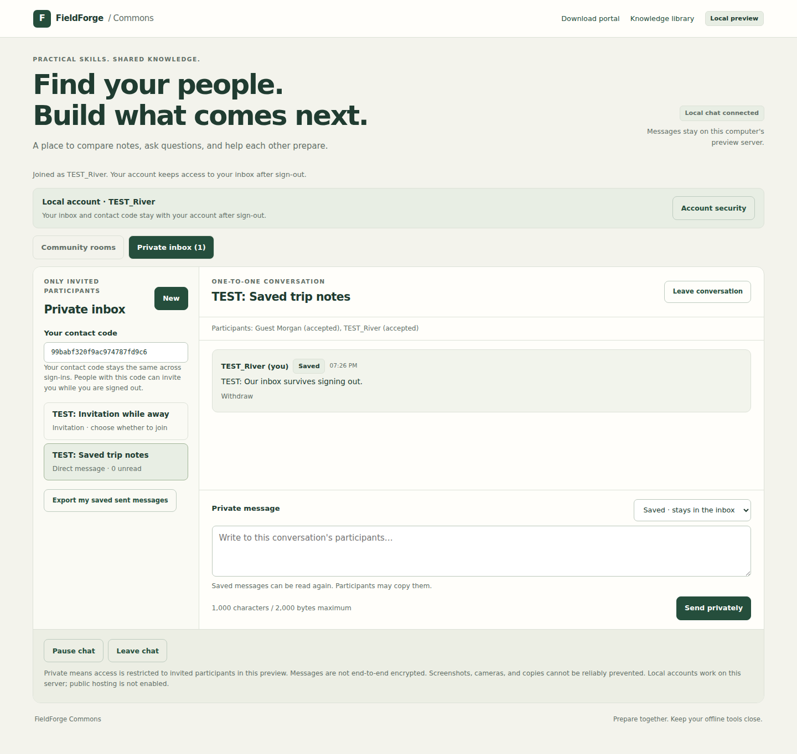

# Local Commons accounts

Commons now supports a saved local account, password sign-in, and recovery with
a private recovery code. Your participant ID, contact code, private inbox,
invitations, blocks, and message ownership survive sign-out, session expiry,
and server restarts **when you keep the same database**.

This is still the loopback-only preview. It is not a public account service,
email service, or social sign-in integration. Accounts on different database
files are separate. No real-world identity or professional qualification is
verified by creating an account.



This screenshot comes from a browser test using explicitly named TEST users
and messages. It contains no passwords or recovery codes.

Saved accounts can now use [My profile](COMMONS_PROFILES.md) for an optional
profile, photo and self-selected interests. A profile starts private; publishing
it, sharing skills and sharing a photo are separate choices. Deleting a profile
keeps the local account, inbox and contact code.

## Try it

Use the [local preview launch instructions](COMMONS_CHAT_PREVIEW.md#start-it).

1. On the Commons page, choose **Create account**. Choose a username and a
   unique password/passphrase of 15–128 characters. Usernames use 3–32 ASCII
   letters, digits or underscores and start with a letter; matching ignores case.
2. Save the displayed recovery code privately, preferably in a password manager.
   It can reset the password and gain access to the inbox. It is shown only once.
3. Use the public rooms and private inbox as usual. **Leave chat** signs out;
   **Sign in** returns to the same account. A new sign-in ends the previous
   session for that account. Ordinary tabs in one browser profile share a cookie.
4. **Account security** checks your current password, lets you set a password,
   and issues a replacement recovery code. Reusing your current password here
   is permitted if you only need to replace the recovery code.
5. If you forget the password, use **Recover account** with the username and
   saved code. This revokes the old session, replaces the password and recovery
   code, then asks you to sign in. Save the replacement code; the old one no
   longer works.

If you already joined as a guest, choose **Save my account** before leaving or
the eight-hour session expires. That upgrades the current participant and keeps
its inbox and sent messages. Its visible name, including on retained messages,
changes to the account username. Expired/logged-out guests cannot reclaim their
old identity by creating a similarly named account.

A saved account's contact code accepts invitations while that account is signed
out. Invitations still require acceptance before messages are readable. The
24-hour deadline for unopened disappearing messages still applies while offline.

Reloading the page makes no chat API requests automatically. **Resume existing
session** is an explicit reconnect action; it works only while the existing
cookie/session is valid. Otherwise use **Sign in**. Pause/resume continues to
work within a joined session without logging out.

## Recovery and lost replies

There is no email reset service or administrator password-reset bypass. Losing
both the password and recovery code loses access through this interface. A local
operator with access to the database is outside this preview's security boundary.

Creation, password changes, and recovery commit before returning the new code.
If a response is lost, the operation might have succeeded. Try signing in with
the chosen password, then use Account security to issue a fresh recovery code.
The API does not replay a previously issued code. A failed sign-in reply can be
retried; the next successful sign-in rotates the session again.

Password fields are cleared after submission and when the tab is hidden. The
displayed recovery code is cleared when dismissed, when the page leaves, or when
the tab becomes hidden. If it was cleared before you saved it, sign in using your
password and generate a replacement. Unsaved chat drafts are cleared on logout
or an expired/revoked session to avoid carrying them into another identity.

## Implementation and boundaries

- Passwords are salted with 16 random bytes and hashed with Python's OpenSSL
  `hashlib.scrypt`: N=32768, r=8, p=3, 32-byte output, 64 MiB allocation cap.
  The stored encoding includes those parameters. Passwords are not trimmed or
  silently truncated. The work factor follows a documented
  [OWASP scrypt configuration](https://cheatsheetseries.owasp.org/cheatsheets/Password_Storage_Cheat_Sheet.html).
- A recovery code contains 256 cryptographically random bits; the database
  stores only its SHA-256 digest. Successful recovery consumes it atomically,
  replaces it, and revokes the current session. Comparison uses `compare_digest`.
- Session tokens contain 256 random bits, are stored as hashes, and last up to
  eight hours. Sign-in, account creation/upgrade and password changes rotate
  them. There is one current session per participant. Cookies are HttpOnly and
  SameSite=Strict. HTTP is limited to loopback; a public service needs HTTPS and
  Secure cookies.
- All credential operations count toward persistent limits: eight attempts per
  username and sixty total per database per fifteen-minute window. Unknown
  usernames count too. At most two account operations can be in progress per
  server instance. Counters survive restarts; their storage is bounded by the
  global limit. These conservative local limits include successful operations
  and can temporarily prevent legitimate sign-ins. They are not production
  abuse protection.
- Wrong passwords and nonexistent usernames return the same credential error;
  both run a password hash. Recovery failures use the same generic response.
  Registration necessarily reports username availability, since names are public.
- No passwords, password hashes or recovery codes appear in chat exports,
  messages or operator reports. Auth responses use the existing no-store headers.
  Inputs require the existing same-origin, JSON, custom-header protections.
- `CLRYAN86`, `King`, and administrator/moderator usernames remain reserved.
  Registration cannot assign roles. [Owner setup](COMMONS_OWNER.md) is a separate
  local-terminal action with authenticator verification. No owner credentials
  are embedded in code.
  Skill labels grant no privileges.

Accounts introduced schema version 3; the owner console adds version 4,
profiles add version 5, and the [inbox lifecycle update](COMMONS_PRIVATE_MESSAGES.md)
adds version 6. These upgrades preserve saved-account data. Version 3 adds accounts and rate-limit counters
to version 1/2 databases.
Saved accounts keep their inbox across expired or revoked sessions. Version 6
retires irrecoverable guest memberships and reclaims conversations only after
their last eligible member leaves; it retains bounded invitation retry records.
Stop the server and back up the database before changing versions. Old binaries
that do not understand the current schema must not be used against the upgraded database.
Restoring a backup may also restore credentials/sessions that had since been
revoked; backup recovery and secret rotation need an operational procedure before
public launch. Do not publish or commit databases or recovery codes.

## Still needed for public launch

Verified email/social identity integration, production administration hardening,
account deletion and lifecycle tools, compromised-password screening, reviewed
distributed abuse controls, HTTPS deployment, recovery/backup operations, and
security review remain unfinished. Hosting/domains/provider credentials are not
configured. The server deliberately remains at `127.0.0.1` with no public binding
option. Screenshots cannot be reliably prevented; message bodies are not
end-to-end encrypted.

Authentication choices were checked against OWASP's
[authentication](https://cheatsheetseries.owasp.org/cheatsheets/Authentication_Cheat_Sheet.html)
and [recovery](https://cheatsheetseries.owasp.org/cheatsheets/Forgot_Password_Cheat_Sheet.html)
guidance on 2026-10-05. This is implementation guidance, not a security certification.

## Verification

On 2026-10-05, the combined chat/account/profile/portal/connection suite passed
**145 tests and six subtests**, including all **eight Chromium browser tests**.
One existing native Tk handoff test was skipped because there is no graphical
desktop in this environment. Scoped Ruff and JavaScript syntax checks passed.
The built wheel was tested outside the source checkout: account persistence,
recovery, and the packaged account interface passed.

`tests/test_commons_accounts.py` exercises upgrade and database restart, stable
inbox ownership, offline invitations, name reservation, password hashing and
input limits, session/recovery rotation, concurrent recovery, persistent rate
limits, and HTTP consent/origin/cookie protections. Browser tests exercise guest
upgrade with retained private messages, sign-out/sign-in, recovery and password
change, second-browser revocation, explicit reconnect, and a lost sign-in reply.

```sh
python -m pytest -o addopts='' -q tests/test_commons_accounts.py
FIELDFORGE_PORTAL_BROWSER_TESTS=1 python -m pytest -o addopts='' -q tests/test_commons_accounts_browser.py
```

Browser tests require Playwright and Chromium, as described in the chat guide.
