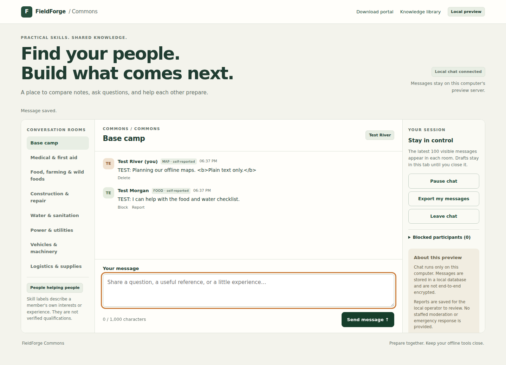

# FieldForge Commons: working local chat preview

This is a real shared chat service for testing on one computer. Separate browser
profiles exchange messages through the same server and SQLite database. It has
no automated replies or seeded conversation. It is not a public community launch.



The screenshot shows the automated two-browser test with explicitly labeled test messages.

## Start it

From a FieldForge source checkout with Python 3.10 or newer, on Windows:

```powershell
python -m fieldforge.online.commons_preview --db "$env:LOCALAPPDATA\FieldForge\commons-preview.sqlite3"
```

On macOS or Linux:

```sh
python -m fieldforge.online.commons_preview --db "$HOME/.fieldforge/commons-preview.sqlite3"
```

Open **http://127.0.0.1:8765/commons** on the same computer. The preview's portal
home at **http://127.0.0.1:8765/** also has an **Open local chat preview** button.
If another portal is using port 8765, add `--port 8767` and use that port in the URL.
After installation, `fieldforge-commons-preview --db PATH` is equivalent.
Keep the terminal open while testing; press Ctrl+C to stop the server.

1. Enter a preview name, optionally select a self-reported skill label, and
   consent to storing messages on the local server.
2. Open a private/incognito window or a different browser profile at the same URL.
   Join with a second name. Ordinary tabs share a session cookie and therefore
   represent the same participant.
3. Send a message in Base camp. It appears in the other participant's room on
   the next refresh, usually within two seconds. Try the other skill rooms.
4. Restart the server with the same database path. Retained messages, blocks,
   reports, and unexpired sessions are still present. A reloaded page asks for
   consent before using an existing session and shows the actual session name.

## Working now

The [private inbox and disappearing-message guide](COMMONS_PRIVATE_MESSAGES.md)
covers direct conversations, invite-only groups, and open-once delivery, including
the limits of browser clearing and screenshots.

- Base camp plus twelve practical skill rooms, with independent room history.
- Plain text messages and optional skill labels; all identities are unverified.
- Persistent storage, timestamps, newest 100 visible messages per room.
- Room switching with separate drafts held in the current browser tab.
- Pause/resume with no automatic reconnection after a failed request.
- Leave chat, which revokes that session on the server. It leaves sent messages.
- Author-only deletion, represented to other participants as a deleted message.
- Participant blocking/unblocking. Blocking hides that participant's messages
  only for the viewer; it does not stop the other participant reading a room.
- Reporting with a reason and local operator review.
- Export of up to 1,000 of the participant's latest retained, undeleted messages.
- Message retry IDs to avoid duplicates after a lost response while the original
  record is still retained. Drafts stay available after a failed send.

Deleting a message removes its text from normal queries, exports, and report
review. It cannot erase screenshots, previous exports, database backups, or
guarantee forensic erasure from the SQLite file. A new preview name/session is a
new participant after logout or expiry and does not regain ownership of old posts.

## Local operator report review

Stop the preview if desired, then run this against its database:

```sh
python -m fieldforge.online.commons_preview --db PATH --review-reports
```

This prints saved reports as JSON. Reports are unavailable through HTTP. There
is no staffed moderation, admin web console, automatic removal, or emergency
response. Reports disappear when their associated message ages out of retention.

## Limits and privacy

The preview binds only to `127.0.0.1` and has no public-bind option. Do not expose
it through port forwarding, a tunnel, or a reverse proxy. Preview names are not
password-protected accounts. Reserved owner/admin names cannot be claimed here,
and a skill label gives no administrative privilege or verified qualification.

No chat API requests occur before joining. Joining and sending explicitly use
the local server; no cloud AI, third-party services, telemetry, external fonts,
or public map providers are contacted. The ordinary production map server has
no chat endpoints. This separate preview command serves an unconfigured map
portal and the chat interface together; it does not load your production catalog.

Session secrets are random and saved only as hashes in the database. Browser
cookies are HttpOnly, SameSite=Strict, scoped to the chat API, and expire within
eight hours. HTTP is intentional for this loopback preview, so its cookie does
not have the HTTPS-only Secure attribute. Chat mutations require the exact local
Origin, JSON, and a custom header. Browser text is rendered as text, not HTML.
Sessions are bearer credentials; local administrators with database/process
access are outside this prototype's protection boundary.

The limits are 1,000 characters / 2,000 UTF-8 bytes per message, at least two
seconds between new messages, 1,000 retained messages per room, and 1,000 total
participant records per database. Old messages are removed as the room exceeds
the count, not by time. Reports and blocks are local; messages are not end-to-end
encrypted. Use a fresh database after reaching the participant limit. Back up or
remove the database only with an understanding of the local data it contains.

## What still blocks a public launch

Verified accounts and recovery, sole-owner administration with MFA, social
sign-in configuration, profile picture handling, reviewed moderation and abuse
controls, HTTPS hosting, operations/backup restoration, privacy/terms, and a
security review are still required. Private messaging is available only within
this local preview; encryption between members, notifications, payments, and
public hosting are not implemented.

## Verification

```sh
python -m pytest tests/test_commons_chat.py tests/test_community_profile.py
```

Browser checks use Playwright, separately installed for development. Set
`FIELDFORGE_PORTAL_BROWSER_TESTS=1` and run `tests/test_commons_chat_browser.py`.
`FIELDFORGE_BROWSER_EXECUTABLE` may point to an installed Chromium test executable.
Tests use temporary databases and explicitly named test participants.

### Initial public-room checks, 2026-10-05

- Combined chat/profile/portal/connection suite: **92 passed, 1 skipped**, plus
  six passing subtests. The skipped test needs the native Tk graphical display;
  both Chromium chat browser tests ran and passed.
- Browser coverage includes two participants, plain-text markup handling,
  reports, blocking/unblocking, deletion, personal export, per-room drafts,
  pause/resume, logout, explicit consent after reload, and a lost send response
  followed by a duplicate-free retry. Desktop and 390-pixel layouts were checked.
- Scoped Ruff checks, JavaScript syntax check, wheel build, and imports/assets
  from the built wheel outside the source checkout passed.
- Native Windows/macOS execution and public hosting have not been verified.
