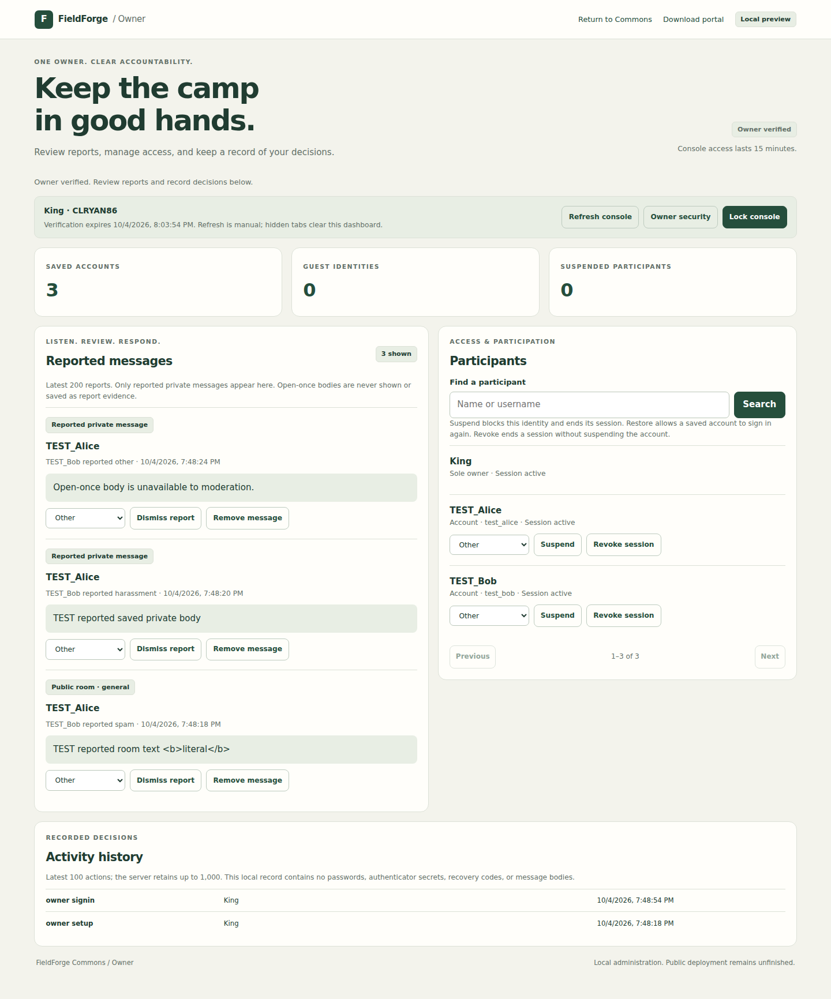

# Sole-owner console

The local Commons preview now has an owner console at **/commons-owner**. It
provides report review, reported-message removal, participant suspension and
restoration, session revocation, and an activity history. The sole owner signs
in as **CLRYAN86**, with the visible chat name **King**.

No owner account or password is preinstalled. Owner setup is an interactive
local-terminal action. Public registration cannot claim the owner names, create
an administrator, or promote an account. This update does not deploy a public
website or configure a real user's authenticator.



The screenshot is from the automated browser test, with TEST participants and
messages. No real community activity, passwords, setup keys or recovery codes
are pictured.

## First setup on your computer

From the FieldForge checkout, install the optional authenticator dependency:

```powershell
python -m pip install ".[commons]"
```

Stop your local preview while setting it up. On Windows, use the same database
path you already use for chat:

```powershell
python -m fieldforge.online.commons_preview --db "$env:LOCALAPPDATA\FieldForge\commons-preview.sqlite3" --init-owner
```

On macOS/Linux, the equivalent is:

```sh
python -m fieldforge.online.commons_preview --db "$HOME/.fieldforge/commons-preview.sqlite3" --init-owner
```

1. Choose a **new, unique 15–128 character password/passphrase** in the terminal.
   The program does not use a password from a chat, source file, or environment
   variable. Password entry is hidden; there are no password command-line flags.
2. Add the displayed private setup key to a TOTP-compatible authenticator app:
   time-based, six digits, 30-second interval. No external QR-code service is used.
3. Enter a current code from that app to prove setup worked. Setup stores the
   owner only after successful verification. It refuses to replace an existing
   owner, and the database enforces a single owner record.
4. Store the displayed **owner recovery code** privately. It is shown only once
   and is needed to recover a lost password or authenticator. Protect/clear the
   terminal output; it contains the setup key and recovery code. Setup refuses
   redirected or non-interactive output.
5. Start chat normally, without `--init-owner`, using the same database:

```powershell
python -m fieldforge.online.commons_preview --db "$env:LOCALAPPDATA\FieldForge\commons-preview.sqlite3"
```

Open **http://127.0.0.1:8765/commons-owner** on that computer, or follow **Owner
console** from Commons. If you chose another port, use that port. Wait for a new
authenticator code after setup, then enter the owner password and code. A code
used for setup cannot be reused for sign-in.

The preview remains bound to `127.0.0.1`. This URL is not a public website and
cannot connect other people's computers. Do not forward or tunnel this preview.

## Using the console

- **Reports:** review the latest 200 retained public/private reports. Only
  reported private message bodies are included, and only for saved messages.
  Open-once bodies are never included, even if still waiting for a recipient.
  Owner status does not make the owner a member of other private conversations.
- **Dismiss report:** record a decision without removing the message.
- **Remove message:** clear the reported message body from chat, exports and
  report review. Removed bodies cannot be restored by dismissing a report.
  Copies already delivered, screenshots and backups cannot be erased this way.
- **Participants:** search and page through accounts, guests, and closed-account
  records, fifty at a time. No passwords, recovery secrets or authenticator keys
  are returned. A closed record displays **Closed account · Access permanently
  removed**, with no access-control buttons. The separate **Closed accounts**
  count excludes these records from **Guest identities**.
- **Suspend:** stop that identity's access, revoke its session, and stop new
  invitations to it. Retained messages remain unless removed separately.
- **Restore access:** allow a saved account to sign in again. It does not revive
  old cookies. A revoked guest cannot reclaim its former identity; use saved
  accounts for durable membership. Guests can create new identities, so guest
  suspension is not a ban on a real person. Restore access cannot reopen a closed
  account.
- **Revoke session:** sign a participant out without suspending the saved
  account. The account can sign in again. The owner cannot suspend, restore or
  revoke itself through these controls.
- **Activity history:** latest 100 actions, with a bounded retention of 1,000.
  Records include the action, target, reason and time, without message bodies
  or credentials. This database record is not a tamper-proof external audit log.

The console refreshes when requested; it does not poll automatically. Opening
or reloading its page makes no API calls until sign-in or **Resume verified
console**. Changing tabs, leaving the page, going offline, or reaching the
verification deadline clears the displayed report/account data. Late replies
cannot repopulate a cleared dashboard. Resume is an explicit action and verifies
the server-side grant again.

The fifteen-minute owner grant has an absolute expiry; refreshing does not
extend it. **Lock console** revokes it immediately. The ordinary chat session
can remain signed in for up to eight hours. **Return to Commons → Resume
existing session** enters chat as King. Ordinary chat sign-out also invalidates
owner access. Opening the owner console again requires both factors after lock
or expiry. Signing in rotates the session and ends the previous one.

## Account closure and retained records

Saved members can now use **Account security → Close account** in Commons. This
requires their own current session and password, a typed account username, and
an explicit confirmation checkbox. The action permanently removes their
credentials, recovery access, profile and normalized photo; revokes their
session; leaves their private conversations; and withdraws all their retained
public and private message bodies, including messages in conversations already
left. **Delete my profile** remains a separate action that keeps the account and
messages. The [account guide](COMMONS_ACCOUNTS.md) explains export before closure
and the full member workflow.

The owner console cannot close another member's account or restore a closed
one. Closed rows remain visible as generic participant references, with their
former usernames reserved by a stored hash. They have no suspend, restore, or
revoke buttons. The server also rejects those operations on a closed target with
HTTP 409, so an older console view cannot re-enable access. The closed record
continues to occupy the existing participant limit.

Closure preserves other people's messages and shared conversation titles and
metadata under the existing retention rules. Incoming blocks, reports,
moderation/audit records, and invitation records can remain, and closure itself
is recorded in the activity history. Formerly authored message bodies are blank
in subsequent report review. Closure cannot recall copies, exports, or database
backups that were already kept.

The sole owner cannot use self-service account closure. The server protects both
the reserved owner username and the participant referenced by the sole-owner
configuration; changing a display name or manipulating the browser cannot bypass
these checks. Owner password changes and recovery remain the separate procedures
below.

## Password changes and factor recovery

**Owner security** requires the current password and a fresh authenticator code.
It changes the password, replaces the recovery code, and signs the owner out.
The authenticator remains paired. Save the replacement recovery code before
signing in with another fresh code. Reusing the current password is permitted
if the goal is to replace a recovery code.

If both factors work but a reply containing a new recovery code is lost, sign in
with the chosen password and a fresh authenticator code. Use Owner security
again to issue a replacement. If a sign-in reply is lost, the TOTP step may have
been consumed; use the next code or explicitly resume if the cookie arrived.

If the password or authenticator is lost, stop the server and run on the same
computer/database:

```powershell
python -m fieldforge.online.commons_preview --db "$env:LOCALAPPDATA\FieldForge\commons-preview.sqlite3" --recover-owner
```

Supply the saved owner recovery code, set a new password, and pair a new
authenticator key. Confirm its current code. Successful recovery atomically
consumes the old recovery code, replaces both credentials, revokes all owner
access, and returns a new recovery code. Regular account recovery cannot reset
the owner, and no HTTP setup, promotion or factor-reset endpoint exists.
Losing the factors and recovery code leaves no recovery path through this UI.

## Security boundaries and remaining launch work

MFA uses the maintained [PyOTP library](https://pyauth.github.io/pyotp/) rather
than a new OTP implementation. Six-digit TOTP uses 30-second steps with a
one-step clock tolerance. The matched step is persisted and consumed atomically;
used/older steps are rejected after restart and under simultaneous requests.
Account attempt limits also apply to owner verification: eight attempts per
15-minute window for the owner and sixty overall per database, including
successful operations. These are local-preview limits and can temporarily block
legitimate sign-in. Password hashing and cookie protections follow the
[account implementation](COMMONS_ACCOUNTS.md).

Each privileged request checks both the sole-owner identity and an unexpired
MFA grant on the server. All HTTP actions keep the exact-origin, JSON and custom
header requirements. Credentials and console responses use no-store headers.
MFA setup/recovery choices were checked against
[OWASP guidance](https://cheatsheetseries.owasp.org/cheatsheets/Multifactor_Authentication_Cheat_Sheet.html)
on 2026-10-05. This is not a security certification.

The authenticator shared secret must be recoverable by the verifier and is stored
in this local database, not hashed. The preview does not encrypt the database.
Protect the database and its backups with OS permissions; a local operator with
filesystem/process access is outside this prototype's protection boundary.
The existing `--review-reports` terminal command remains available to that local
operator without a browser sign-in. Backup restoration can restore old factors,
sessions or consumed counters; production backup/rotation procedures remain needed.

Schema version **4** introduced owner configuration, grants, participant
controls, moderation resolutions and the bounded audit history. Versions **5**
and **6** added profiles and the private-inbox lifecycle. The current **version
7** adds account export authorizations and closed-account records, while
preserving existing owner configuration and eligible account/chat records.
Current owner utilities preserve the newer schema version. Back up the database
before upgrading and do not run older binaries against a version they do not
understand.

**Public hosting, verified email/social sign-in, production abuse controls and
independent security review remain unfinished.** Local account export and
self-service closure are implemented, with the sole-owner restriction described
above.
Public deployment also needs HTTPS/Secure cookies, host/domain configuration,
secret and backup operations, reviewed moderation procedures and monitoring.
TOTP is not phishing-resistant; hardware-backed passkeys are not implemented.
Messaging is not end-to-end encrypted, and screenshot prevention is not promised.

## Verification

The current schema 7 export/closure checks are recorded in the
[account lifecycle verification](COMMONS_ACCOUNTS.md#account-lifecycle-verification).

For the earlier owner-console release, on 2026-10-05 the combined
chat/account/owner/profile/portal/connection suite
passed **163 tests and six subtests**, including all **ten Chromium browser
tests**. One existing native Tk handoff test was skipped because this environment
has no graphical desktop. Scoped Ruff and JavaScript syntax checks passed.
The installed wheel was also checked outside the source checkout for owner
setup, MFA verification, report access, and packaged console assets.

Backend tests cover sole-owner provisioning, MFA replay/concurrency, denied
ordinary-user access, grant expiry/revocation, suspension/restoration, reported
private content boundaries, message removal, secret rotation, migration,
persistent throttling, bounded audit history, and HTTP protections.
Browser tests cover owner sign-in, moderation reflected in another user's chat,
suspension/restoration/revocation, private report limits, explicit reconnect,
expiry, credential changes, and returning to chat as King.

```sh
python -m pytest -o addopts='' -q tests/test_commons_owner.py
FIELDFORGE_PORTAL_BROWSER_TESTS=1 python -m pytest -o addopts='' -q tests/test_commons_owner_browser.py
```

Install the `commons` extra for these tests. Browser tests also need Playwright
and Chromium. Test credentials, keys and database files are temporary fixtures;
no real owner was provisioned during development.
