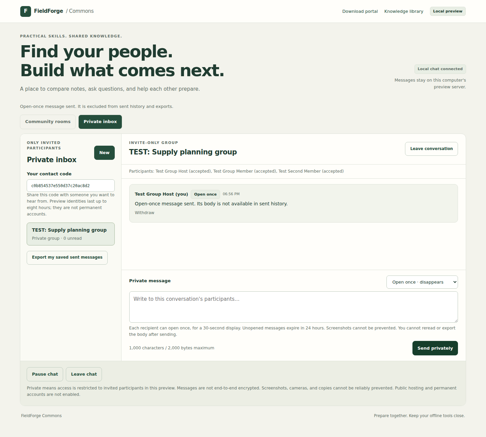
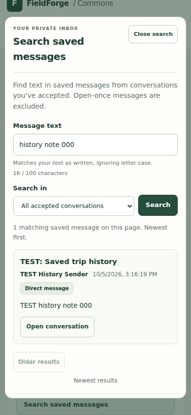

# Private inbox and disappearing messages

This extends the **local** FieldForge Commons preview. It is a working inbox
inside the program, not an email service: it does not send email or connect to
external mail accounts. Launch it with the [existing preview command](COMMONS_CHAT_PREVIEW.md#start-it),
then choose **Private inbox** after joining. [Local accounts](COMMONS_ACCOUNTS.md)
now let you keep the same inbox across sign-outs and server restarts.

The screenshot uses test participants. No real community activity is fabricated.

## Start a conversation

### Use contact codes

1. The recipient opens Private inbox and shares their contact code with you.
   Preview names are unverified; confirm the code with the intended person.
2. Choose **New**, select a one-to-one conversation or a private group, enter a
   subject/group name, and paste the recipient codes. Groups support eight
   participants including the creator.
3. The recipient sees an invitation with its title and participant list. They
   must accept before reading or sending messages. Acceptance makes messages
   sent since the invitation available to them.
4. Use **Saved** for ordinary inbox messages, or select **Open once** before
   sending. Each conversation retains its own unsent draft in the current tab.

### Invite someone from the member directory

A saved account holder can also open **Member directory** and choose **Invite
to chat** on another member's card when that member has separately enabled
directory invitations. Review the recipient, enter a **Conversation subject**,
then choose **Send invitation**. This route creates a one-to-one conversation
using an opaque profile ID; groups continue to use contact codes in **Private
inbox → New**. Guests can browse shared profiles but need a saved account to
send a directory invitation.

Listing a profile does not enable invitations. The additional consent starts
off for new and existing profiles, and takes effect only while the profile is
listed. Before creating an invitation, the server rechecks current visibility,
consent, account availability, suspension, and blocking. A stale directory card
cannot override a member's latest choices. See the
[profile guide](COMMONS_PROFILES.md#your-sharing-choices) to change that consent.

The recipient gets the same accept, decline, and **Decline and block sender**
controls as a contact-code invitation. Turning off directory invitations,
withdrawing the listing, or deleting the profile prevents new directory
invitations. It does not cancel existing invitations or conversations, or stop
contact-code invitations. Use the inbox's decline, leave, or block controls as
needed.

The directory and its invitation API response do not expose the recipient's
contact code. Normal inbox participant metadata still includes participant IDs
and contact codes for people with legitimate conversation access. This feature
keeps contact codes out of the directory; it does not make them secret from
conversation participants.

## Membership and blocking

Recipients who were never invited cannot list, read, open, post, report, or
withdraw messages in that conversation. Every operation checks membership on
the server. Knowing a thread ID or another person's contact code grants no access.

Members may leave; a left or declined invitation cannot be rejoined in this
preview. Declining or leaving immediately frees that participant's conversation
slot. Create a new conversation to add members, subject to the invitation limits
below. Blocking either direction
stops new private invitations/messages between those people and consumes their
pending open-once deliveries to one another. An unwanted invitation offers
**Decline and block sender**, so the recipient can stop further contact without
accepting or reading the conversation. In a group, a sender with a blocked
recipient must use a different conversation to continue sending. Other unblocked
members may continue their own conversation. The Community rooms tab retains the
block list and Unblock control.

## Read older messages

An accepted conversation opens on its latest **100 visible messages**. Choose
**Older messages** to read the previous page, and **Back to latest** to return to
recent messages. Each conversation retains up to **200 messages** across all
participants; blocked or unavailable messages can make a page shorter.

The preview keeps refreshing the page you are viewing. New messages do not pull
you out of older history. Withdrawals, blocking, expiry and membership checks
still apply to every page. Saved messages are marked read only when their page
is fetched; opening the latest page does not silently mark older pages read.
Open-once placeholders remain unread until explicitly opened, withdrawn or
expired, and their bodies never appear in history pages.

Leaving the inbox, pausing, hiding the tab or changing participants clears the
displayed history. Reopening starts at the latest page. A new message can age
out an older retained message even while its page is open; use Back to latest
if that older page becomes empty. History navigation does not restore messages
that have already aged out of the 200-message retention limit.

## Search saved messages

The screenshot uses a temporary database and explicitly labeled test messages.

Choose **Private inbox → Search saved messages**, enter a word or phrase, and
choose **Search**. The default scope is **All accepted conversations**. When
you have an accepted conversation open, you can narrow the search to that
conversation. Pending invitations and conversations you left are excluded.

Search matches text in saved message bodies, including messages you sent and
messages delivered to you. It is case-insensitive for Unicode text and treats
punctuation such as `%`, `_`, and `*` literally. It does not search conversation
subjects, use regular expressions, or expand individual words. Enter a single
line of up to 100 characters; leading and trailing whitespace is trimmed, while
spaces inside the phrase remain significant.

Results show at most **20 matching saved messages**, newest first, with the
conversation title, author, date and message text. Choose **Older results** to
continue or **Back to newest** to start again with current results. Each request
checks your current session, accepted membership, intended delivery and blocking
in both directions. Withdrawn, moderated, expired or no-longer-retained content
cannot be recovered by searching. Open-once messages are excluded entirely,
including unopened messages and your own sent open-once bodies.

Searching does not mark saved messages read or open a sealed message. While the
search dialog is open, the browser also suspends history reads for the conversation
behind it. **Open conversation** fetches a fresh history page around the matching
message and highlights it for keyboard focus. That page follows the normal saved
message read-receipt rules. If the message is no longer available, the interface
says so; it does not restore the text from the search result. **Back to latest**
returns to the conversation's newest page.

Opening the search form or typing makes no search request; submitting, paging
and opening a result are explicit actions. Closing the search dialog, hiding the
tab, pausing chat or changing accounts clears the query and displayed results.
Reopening starts with an empty form. Search text is not saved in the URL, browser
storage or the database. Results are fetched when you search or change pages,
not continuously refreshed. A previously displayed result can become outdated;
opening it always rechecks access and retention.

### Search API

`POST /api/commons/private/search` uses the same local session, Origin, JSON and
displayed-participant protections as the rest of the inbox. The required field
is `query`; optional fields are `thread` (an accepted conversation ID or `null`)
and `before` (an exclusive, positive JavaScript-safe message ID or `null`).
Unknown fields are rejected.

The response has `query`, `thread`, `before`, `older_before`, and `results`.
Each result includes `id`, `thread`, `title`, `kind`, `author`, `name`, `created`,
`body`, and `own`. `older_before` is the last returned message ID when additional
visible matches remain, or `null`. A cursor is only an ID boundary and grants no
access. New messages and retention can change later results; this is a search
of currently retained data, not a frozen export. Search itself requires no
database migration or extra dependency. The current schema is version 9,
which adds the separate [owner-announcement feature](COMMONS_OWNER.md#owner-announcements).

## Conversation capacity and invitation limits

The local preview applies these separate limits:

| Limit | Behavior |
|---|---|
| 20 conversations per participant | Counts accepted conversations and pending invitations. Declined and left memberships do not count. |
| 200 conversations per database | A conversation remains while any accepted or invited member can return to it. |
| 20 invited recipients per sender in a rolling 24 hours | Each group recipient counts separately. An unsuccessful invitation or an unchanged retry uses no extra allowance. |
| One new invitation to the same participant per hour | Applies across directory invitations, contact-code direct conversations, and groups, including after a decline or a closed conversation. The other participant has their own sending allowance. |
| 20,000 invitation retry records per database | New invitations wait for old closed records to expire if this bound is reached. Existing conversations remain accessible. |

Directory invitations and contact-code invitations share these capacity,
recipient, and retry-record limits. Switching between them does not provide
another hourly or daily allowance. The limits persist across server restarts
and sign-ins. A rejected group invitation is atomic: no participant receives a
partial invitation and none of the sender's allowance is consumed. Blocking in
either direction stops new invitations regardless of the time limits. These
controls apply to a participant identity. Creating a new guest identity can
bypass that identity's allowance; public registration and abuse prevention
remain separate work.

Leaving preserves the conversation for its remaining participants, including a
single remaining member who wants to keep saved history. When nobody remains,
the preview removes that conversation's title, memberships, messages, deliveries
and associated reports. Guest identities that have logged out or expired cannot
return; their memberships are retired during private activity, startup or the
once-per-minute sweep. Saved accounts retain their memberships while signed out,
expired or suspended because they may regain access later.

A small invitation receipt retains the original conversation ID, sender,
recipient IDs, request ID, content fingerprint and timestamps. It contains no
message bodies or readable subject. It stays as long as the conversation exists,
then for seven days after the last member leaves. During that period, retrying
the original request returns its original result, marked closed if appropriate;
it never recreates the conversation or sends another invitation. Reusing that
request ID with different invitation content is rejected. After an expired
closed receipt is removed, a submission is treated as a new invitation and must
pass the current capacity, availability, blocking and invitation limits.

An exact retry of a successful directory invitation may return that same
original result after the recipient turns off directory invitations, hides or
deletes the profile, or after the conversation closes. The receipt confirms the
earlier operation; it does not create a conversation or send another invitation.
A new directory invitation must always pass the current listing and consent
checks, as well as the shared limits above.

If a directory invitation response cannot be confirmed, chat pauses. Resume
chat and check **Private inbox** for the conversation. In **Member directory**,
choose **Review pending invitation** to inspect and explicitly retry the same
request, even if that member has since withdrawn their listing. Reopening a
still-available card also restores its pending subject. Nothing is sent
automatically. Keeping the same recipient and subject, with whitespace
normalized, reuses its request ID. A confirmed closed result cannot reopen the
conversation.

Closing or hiding the dialog clears its displayed fields and ignores late
replies, although an already submitted invitation may still finish saving. The
unconfirmed request remains only in the same tab and identity for an explicit
retry; it does not survive a reload, sign-out, account switch, or deletion of
the sender's profile. Replies from an older view cannot open an inbox or replace
the next recipient's draft.

## Saved versus open-once delivery

| Behavior | Saved | Open once |
|---|---|---|
| Message body appears in conversation history | Yes | Never; history shows a placeholder |
| Recipient action | Open the accepted conversation | Explicitly choose **Open once** and confirm |
| Body can be fetched again | Yes, while retained and still a member | No, even after a failed delivery reply |
| Sender can reread from sent history | Yes | No |
| Personal sent-message export | Included | Excluded |
| Report body available to the local operator | Yes, if retained | No; only reason and message metadata |
| Automatic expiry | By the 200-message conversation retention limit | After opening by all recipients or 24 hours unopened, whichever comes first |

Opening is an atomic server operation: it marks that recipient's delivery as
consumed before returning its body. Simultaneous open requests cannot both
retrieve it. If the reply is lost, the body is not replayed; the recipient may
lose the message without seeing it. The interface explains this before opening.

The browser shows the delivered text in a dialog, then clears it after 30
seconds, on closing the dialog, on leaving the tab, or on pausing/leaving chat.
Each group recipient has a separate one-time delivery. The server keeps a body
only while another original recipient can still open it, up to the 24-hour
deadline. A recipient leaving or being blocked consumes their pending delivery.
Expiry is checked during private API use, at server startup, and by an idle
server sweep once per minute. A stopped server cannot sweep its database until
it starts again. Expired bodies are never returned by the API.

**Screenshots cannot be reliably prevented.** A recipient can use operating
system capture tools, another camera, developer tools, or a modified client to
retain delivered content. Browser clearing is a convenience, not a guarantee
that someone cannot preserve a copy. There are no screenshot-blocking or
screenshot-detection claims in this feature.

The database is not end-to-end encrypted. The local operator can inspect stored
data. Clearing body fields and enabling SQLite secure deletion do not guarantee
erasure from backups, filesystem snapshots, memory, or recipient devices. Thread
titles, participant records, message IDs/times, and delivery state remain after
a body is cleared. Do not put sensitive content in a disappearing message's
subject and expect that subject to disappear.

Saved account holders can use **Account security → Export my account data** for
all their retained saved sent messages, including those in conversations they
previously left. It excludes all open-once bodies and never consumes a delivery.
**Close account** withdraws all of that account's retained authored bodies,
leaves its conversations and revokes its access. Other members keep their
messages and conversation access while an eligible member remains; final-member
cleanup and existing retention still apply. Shared titles and safety references
may remain. See [account export and closure](COMMONS_ACCOUNTS.md) for the exact
scope, confirmations and retained-data limits.

## Important preview limits

- Guest identities expire within eight hours; logout or expiry loses their inbox
  access. Save the guest as an account before leaving to retain its identity.
  Local accounts sign back in to the same inbox after session expiry or logout.
- The service still binds only to `127.0.0.1`; it is not exposed publicly.
- No public accounts, email recovery, social sign-in, attachments, notifications,
  external email delivery, or end-to-end encryption are implemented.
- Each conversation retains 200 messages, displayed in pages of at most 100.
  A new message can age out the oldest message even if it was unread. Personal export contains
  up to 1,000 saved messages sent by the current participant in conversations
  they still belong to. The account-data export described above has no
  1,000-message cutoff and includes retained sent messages after leaving.
- Sending is limited to one new message every two seconds across public and
  private conversations. Duplicate retries do not resend retained messages.
- Reports go to the local operator using `--review-reports` or the
  [authenticated owner console](COMMONS_OWNER.md); no staffed
  moderation or emergency response is available. Open-once bodies are never
  retained as report evidence.

Private messaging introduced schema version 2; the inbox lifecycle update added
**schema version 6**. It adds invitation receipts and backfills existing
invitations before reclaiming fully left conversations or irrecoverable guest
memberships. It preserves public room history, saved accounts, profiles and
photos, owner configuration, and private history that still has an eligible
member. Account export/closure introduced **schema version 7**, adding account
closure references and temporary export authorizations. The directory
invitation update uses **schema version 8**, adding the profile's separate
`allow_invitations` choice with a false default. Existing listed profiles also
migrate with directory invitations off. Current **schema version 9** adds owner
announcements and their retry records without changing private-message storage.
Preview and owner utilities preserve version 9.
Stop the preview and keep a backup of test data before changing versions; older
code that does not support version 9 must not operate on the upgraded database.
The preview refuses to use an unrelated application database.

## Public launch status

The existing Linux/Caddy deployment examples apply to the map portal; they do
not turn this local-account preview into a public messaging service.
There is still no configured public hostname or public Commons deployment.

The next release work is verified sign-in and email recovery integration,
production abuse/moderation operations, deployment hardening,
HTTPS and secure sessions, backups and recovery testing, and deployment to a
chosen host. Email/social provider configuration and an operator-controlled
domain are not supplied by an OpenAI API account.

The screenshot restriction cannot be promised at public launch either. An
end-to-end encrypted mode would require a maintained protocol/client and a
separate review; this implementation does not build custom cryptography.

## Initial private-message verification, 2026-10-05

The combined chat, private-message, profile, portal and connection suite passed
**113 tests plus six subtests**. One existing Tk desktop handoff test was skipped
because this run has no native graphical display. All **five Chromium browser
tests** ran, including three-browser private group delivery, unauthorized inbox
access, invite acceptance, saved replies/exports, automatic 30-second clearing,
and a lost open response that cannot be replayed.

Storage tests also cover simultaneous open requests, per-recipient consumption,
expiry after restart and during an idle server sweep, invitation/message retry
IDs, blocking, leaving, author-only withdrawal, bounded retention, and the
version-1-to-2 database migration. Ruff and JavaScript syntax checks passed.
The built wheel was checked outside the source checkout: private assets were
present and a private invitation followed by one-time delivery succeeded.

## Inbox history and lifecycle verification, 2026-10-05

For the inbox history and lifecycle update, the combined Commons, profile/photo,
community, portal and connection suite passed **311 tests and six subtests**,
including all **28 Chromium browser tests**, in 198.44 seconds. One existing
native graphical portal handoff test was skipped because this environment has
no graphical desktop.

This update adds 26 history/API regressions, 20 invitation lifecycle regressions,
and six browser scenarios. They exercise more than 100 unread messages, sparse
cursor IDs, per-page saved read receipts, blocked/undelivered messages, sealed
open-once content, fresh withdrawal/expiry checks, retention-empty pages,
late-response cleanup, mobile layout, decline-and-block, and a lost invitation
reply retried after closure. Lifecycle tests cover concurrency, exact hour/day/
seven-day boundaries, weighted group invitations, bounded retry records,
saved-account preservation, orphan guest cleanup, and schema-5 backfill.

Repository-wide Ruff, JavaScript syntax and whitespace checks passed. The wheel
was installed outside the source checkout and checked with `python -S`, without
optional packages, for matching packaged assets, 103-message history/read
receipts, reusable capacity, closed retries, schema version 6 and restart.
An independent review found no material issue in the new pagination, lifecycle,
retry or migration paths. These checks do not constitute a public-launch
security review.

## Saved-message search verification, 2026-10-05

The combined Commons, profile/photo, community, portal and connection suite
passed **510 tests and six subtests**, including **65 Chromium browser tests**,
in **383.34 seconds**. One existing native graphical portal handoff test was
skipped because this environment has no graphical desktop.

The final search-specific browser run passed **all 13 scenarios** in
**31.49 seconds**, including an additional composer-focus regression added after
the combined run had collected its tests. The search increment adds **58
backend/HTTP cases** and these **13 browser scenarios**. Coverage includes
literal Unicode matching, exclusive pagination, old matches behind more than
100 nonmatching messages, intended-delivery restrictions, pending/left
membership, blocking in both directions, withdrawal, expiry, suspension,
account closure and unchanged unread/open-once state.

Real browser checks cover mobile layout, current-conversation filtering,
safe plain-text rendering, explicit search submission, late replies after edits,
close/hide/pause/sign-out, shared-cookie account switches, older-result history
jumps, membership loss between inbox discovery and history fetch, stale
navigation, retained keyboard focus after read-receipt updates, and preserving
focus while someone starts typing during a delayed history reply. Independent
review identified and rechecked the two keyboard-focus fixes; no remaining
material issue was found in the reviewed paths.

Repository-wide Ruff, changed JavaScript syntax and whitespace checks passed.
A built wheel was installed outside the checkout and exercised using
`python -S`, without optional dependencies. Its actual HTTP server served the
search asset and verified search/paging, an older hit, unchanged unread counts,
open-once exclusion, history navigation, withdrawal, membership loss, schema 8
and database reopen. All **32 packaged online code/asset files** matched the
tested source bytes. These checks do not constitute a public-launch security
review or native Windows/macOS verification.
