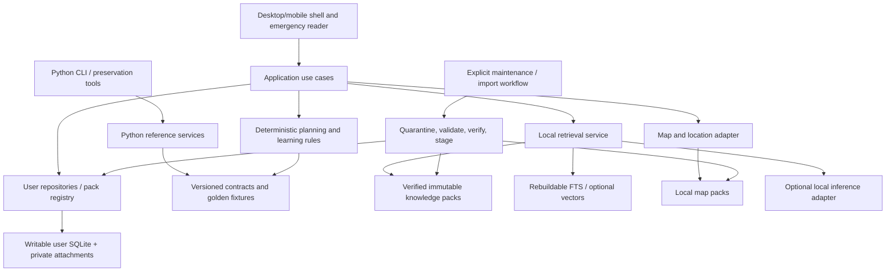
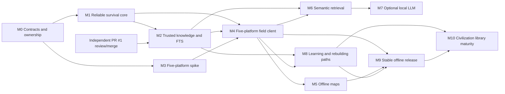

# FieldForge Master Roadmap

**Engineering audit and proposed delivery plan — 2026-09-29**

FieldForge should become a durable offline reference, planning, and teaching system: useful during the first minutes of an emergency, through household and community recovery, and through rebuilding the scientific, technical, and institutional capabilities of a modern society. Its essential value must survive loss of internet access, accounts, model availability, and working infrastructure.

The present implementation is a useful small Python preparedness prototype. It has working local storage, calculators, a CLI, and a basic desktop interface. It is not yet a complete survival reference, a validated knowledge library, a mobile application, or a civilization learning system. The immediate engineering priority is trustworthy data and emergency operation; AI is an optional later capability.

Navigate: [audit scope](#1-audit-scope-evidence-and-change-boundary), [capability assessment](#2-product-contract-and-capability-assessment), [file ledger](#3-complete-file-by-file-audit-ledger), [findings](#4-prioritized-engineering-findings), [architecture](#5-target-architecture-and-incremental-transition), [survival UX](#6-survival-core-and-emergency-interaction), [taxonomy](#7-civilization-knowledge-taxonomy-and-teaching-model), [content](#8-content-provenance-validation-and-pack-lifecycle), [search/AI](#9-offline-search-retrieval-rag-and-local-llm-support), [maps](#10-maps-and-navigation), [storage](#11-storage-durability-backup-importexport-and-preservation), [security](#12-security-and-privacy-engineering), [release engineering](#13-packaging-compatibility-and-release-engineering), [testing](#14-testing-strategy-and-measurable-operating-budgets), [milestones](#15-implementation-milestones-dependencies-and-acceptance-gates), [repository structure](#16-recommended-repository-structure), [risks](#17-open-decisions-risks-and-governance).

## 1. Audit scope, evidence, and change boundary

This document audits `main` at [68b046c7681d7f1499375cc97f614a29c0ca27ec](https://github.com/clryan86/FieldForge/tree/68b046c7681d7f1499375cc97f614a29c0ca27ec). Every one of its **27 tracked files** was read: **19 application Python files, four test files, and four documentation/configuration files**. The recursive Git tree was not truncated. There is no tracked `AGENTS.md` at this baseline. Section 3 is the complete file ledger.

This is a documentation-only proposal. It introduces no application implementation, schema change, dependency change, content corpus, or test change.

### Relationship to existing knowledge work

[PR #1, “Add offline knowledge-search foundation”](https://github.com/clryan86/FieldForge/pull/1), was an open draft at inspection, with head `chatgpt/offline-knowledge-foundation` at `4b0b24e1e5697db6a848ffa706b1a08dcf31c9cd` and the audited `main` commit as its base. Its description and changed-file list were inspected to establish ownership; its implementation is **not** counted as functionality already merged into `main` or independently certified by this audit.

That PR owns the initial SQLite FTS5 knowledge library, article upserts, provenance/review/safety/checksum metadata, application/dashboard integration, CLI knowledge commands, and focused knowledge tests. Its five changed paths are `fieldforge/app.py`, `fieldforge/cli.py`, `fieldforge/knowledge/__init__.py`, `fieldforge/knowledge/library.py`, and `tests/test_knowledge.py`.

This roadmap must be reviewed on a separate branch based on `main`. Do not edit, merge, cherry-pick, copy, or recreate PR #1 or its branch as part of this task. Milestone M2 consumes its reviewed contract after independent review/merge. If that work is delayed, advance content specifications, licensing review, evaluation fixtures, and interface mockups; do not create a competing foundation. The additional branch `codex/knowledge-base` was observed but is not a second implementation target or the baseline for this roadmap.

### Verification performed

| Check | Result and limits |
| --- | --- |
| Complete baseline inspection | All 27 files fetched at the immutable commit and inspected; no source or test omitted. |
| Local environment | Windows x64, Python 3.12.14, SQLite 3.53.1; isolated workspace virtual environments. |
| Existing tests | `python -m pytest`: **16 passed**. This is functional evidence for existing assertions, not evidence of exhaustive coverage. |
| Existing lint | Ruff 0.16.9, `ruff check .`: **passed** against the baseline. |
| Build | `python -m build --wheel`: **passed**. |
| Packaged CLI | Built wheel installed with `pip install --no-index --no-deps` into a separate clean environment; `init`, `scenario power_outage`, and `dashboard` passed outside the source directory. |
| Upstream CI | Baseline [CI run 36584774679](https://github.com/clryan86/FieldForge/actions/runs/36584774679) reported success; workflow covers Ubuntu/Python 3.10 and 3.12. |
| Focused fault probes | Disposable databases reproduced backup omissions, duplicate restore, partial restore after a database write failure, schema marker overwrite, incident count truncation, malformed backup exception, non-finite input acceptance, and zero-readiness evacuation feasibility. |
| Release inventory | No GitHub releases were returned at inspection. No native installer definitions exist in the tracked tree. |

The GUI was reviewed statically, not exercised through a screen reader or interactive test session. macOS, Linux desktop, Android, and iOS execution was not performed locally. No clinical validation, penetration test, coverage percentage, performance benchmark, battery measurement, or physically disconnected-device certification is claimed. The clean wheel install used no package index; that alone does not constitute a network-denial test of the application.

## 2. Product contract and capability assessment

### Non-negotiable outcomes

1. **First-use offline usefulness:** a fully provisioned installation includes reviewed survival references and calculators. Opening the app never requires registration, activation, a download, a model, or a successful connectivity check.
2. **Preservation beyond the app:** knowledge is exportable with provenance, readable in documented open formats, printable, and recoverable without a proprietary service.
3. **Progressive teaching:** connect immediate tasks to prerequisites, explanations, practice, assessment, and increasingly capable tools and infrastructure.
4. **Evidence before confidence:** calculations disclose inputs and assumptions; advice discloses source, applicable conditions, review status, and limitations. A readiness score, retrieved page, signature, or model answer is not proof of safety.
5. **Five platform families:** Windows, macOS, Linux, Android, and iOS share portable content/data contracts and essential behavior. Device-specific acceleration and maps may vary; essential references and planning do not.
6. **Graceful failure:** low storage, a damaged optional pack, unavailable location, denied permissions, expired update metadata, or an absent AI model must not prevent reading bundled emergency guidance.
7. **Private by default:** no required account, telemetry, remote inference, or background upload. Connectivity is a deliberate maintenance or sharing action.

### What exists and what is missing

| Area | Present on audited main | Missing or materially incomplete |
| --- | --- | --- |
| Survival planning | Household profiles; water/food runway; battery, generator, solar estimates; go-bag score; evacuation estimate; readiness score | Scientific/source review of defaults; units and usability state; complete editing flows; persisted plans and checklists; dependency-aware actions |
| Emergency operation | Five static scenarios; priority labels; incident journal via CLI; desktop checklist tab | One-action emergency access; actionable completion state; resilient read-only fallback; print; contacts; accessibility validation |
| Data | Local SQLite; parameterized values; per-operation transactions; quantity checks; category/expiry indexes | Ordered migrations; future-version rejection; complete CRUD; stable portable IDs; full restore transactions; storage recovery |
| Backup | Version-2 JSON; SHA-256 corruption check; temporary-file replacement; pre-parsing of records | Incident/event coverage; consistent snapshot; idempotent merge or replacement semantics; bounded parsing; encryption; restore previews |
| Knowledge | README intent only on main; PR #1 separately in progress | Shipped reviewed corpus; taxonomy; reader; learning paths; citations and review workflow; pack lifecycle; search quality measurements |
| Search and AI | None on main | PR #1 integration after review; filters/ranking evaluation; semantic retrieval; grounded RAG; local model runtime and evaluation |
| Maps | Stored waypoints; great-circle distance; initial true bearing; pace count | Map renderer/assets; GPS integration; route model; offline geocoding/routing; imports/exports; stale-data indicators |
| Desktop/mobile | Tkinter dashboard, inventory addition, power planner, scenarios; CLI | Native distribution; accessible responsive shell; Android/iOS applications; lifecycle and platform adapters |
| Security/privacy | Local operation; no network API imports found in application source; basic input validation | Threat model; malicious import protections; authenticated packs; privacy controls; optional vault; secure release/update process |
| Testing/release | 16 tests, lint, Ubuntu CI, setuptools wheel, two entry points | GUI/device tests; offline fault matrix; packaged installation tests in CI; signing; SBOM; reproducible environment; release runbooks |

The README's directory diagram and unchecked milestone boxes are aspirational and not a precise implementation inventory. In particular, `knowledge/`, `knowledge_base/`, and `docs/` are absent on audited main, while many of its v0.1 checklist capabilities already have partial implementations.

## 3. Complete file-by-file audit ledger

Paths below refer to the audited commit. “Missing” describes observed gaps, not changes made by this PR.

| File | Existing responsibility and audit result |
| --- | --- |
| `fieldforge/__init__.py` | Exports version 0.1.0; version is also stored in pyproject, with no consistency check. |
| `fieldforge/app.py` | Service facade for members, inventory, waypoints, incidents, alerts, scenarios, readiness, evacuation, dashboard. Useful separation from interfaces, but direct concrete DB construction, repeated independent reads, no full edit API. Incident dashboard count is capped at 100. |
| `fieldforge/cli.py` | Argparse CLI, JSON output, environment/path override, 21 subcommands. Every command constructs a writable database, including static scenarios/calculators. Numeric helper named “finite” does not enforce finiteness. SQLite and malformed-container errors can escape its exception handling. |
| `fieldforge/core/__init__.py` | Package docstring only; no hidden behavior. |
| `fieldforge/core/models.py` | Frozen member, inventory, emergency-action dataclasses; priority/category enums; serialization and basic bounds. No uniform finite/type validation, canonical unit model, lot usability status, stable cross-device IDs, or editable domain operations. |
| `fieldforge/core/backup.py` | JSON v2 export/restore, canonical SHA-256, constant-time checksum comparison, temporary rename, full model parsing before writes. Only members/inventory/waypoints included; each insert commits separately; IDs discarded; repeated restores append; no snapshot transaction, input quotas, encryption, or authentication. |
| `fieldforge/core/readiness.py` | Visible weights, capped component scores, letter grade, recommendations. Targets are hard-coded, not source-versioned; arithmetic validation is incomplete; no explicit unknown-data component state or uncertainty model. |
| `fieldforge/db/__init__.py` | Package docstring only. |
| `fieldforge/db/database.py` | Creates metadata, members, inventory, waypoints, incidents, events; parameterized operations; connection commit/rollback; inventory quantity update/delete. CREATE IF NOT EXISTS plus overwriting a version marker is not a migration system. No aggregate unit-of-work, full CRUD, upgrade guard, backup snapshot, or operational recovery API. |
| `fieldforge/navigation/__init__.py` | Package docstring only. |
| `fieldforge/navigation/geo.py` | Validated waypoint coordinates; haversine distance, true bearing, pace count. No maps, routing, sensors, coordinate import, or uncertainty metadata. Coincident/antipodal bearing semantics need explicit handling and tests; pace numeric inputs need finite checks. |
| `fieldforge/planners/__init__.py` | Package docstring only. |
| `fieldforge/planners/evacuation.py` | One-vehicle/one-destination capacity/range estimate. Vehicle readiness affects score but not feasible boolean; destination confirmation is only a boolean. No persisted plan, route hazards, timestamped confirmation, multi-vehicle assignment, or mobility/pet constraints. |
| `fieldforge/planners/kits.py` | Fourteen-item go-bag template and weighted name-based assessment. Library only; not wired into persisted plans or dedicated CLI/GUI flows. No quantities, expiry, substitutions, household-specific kit requirements, or duplicate-template validation. |
| `fieldforge/planners/resources.py` | Pure water, food, battery, generator, and solar arithmetic with reserve/efficiency parameters. Runway includes all category-matching stock regardless of usability/expiry; constants are not source-versioned; non-finite quantities and loads can propagate. |
| `fieldforge/scenarios/__init__.py` | Package docstring only. |
| `fieldforge/scenarios/engine.py` | Five named scenario lists; normalized lookup; priorities/reasons; unknown-name error. Actions are not priority-sorted or dependency-ordered and have no IDs, sources, review dates, context, or durable completion. |
| `fieldforge/ui/__init__.py` | Package docstring only. |
| `fieldforge/ui/desktop.py` | Lazy Tkinter import; four tabs, inventory/member addition, battery/solar inputs, scenario text. Minimum 900x620 window; nested synchronous callbacks; no GUI tests. Inventory cannot supply calorie/liter/expiry/minimum fields; no edit/delete, backup, journal, knowledge, waypoint, or learning UI. |
| `tests/test_cli.py` | Two broad happy-path tests cover household/inventory/dashboard and scenario/power/navigation/journal/evacuation. Does not exercise all commands, subprocess packaging, invalid input, permissions, restore failures, or actual network denial. |
| `tests/test_database_backup.py` | Three tests cover DB round-trip/alerts/quantity update, backup including waypoints, and checksum tampering rejected before writes. Missing incidents/events in backup is not detected; no write-failure rollback, repeated restore, malformed structure, or migration tests. |
| `tests/test_readiness_scenarios_navigation.py` | Seven tests cover full/low readiness, scenario lookup, basic northward geodesy, invalid coordinates, and two evacuation cases. “Prioritized actions” test checks existence of a critical item, not ordering; zero-readiness vehicle and numerical edge cases untested. |
| `tests/test_resources.py` | Four tests cover normal reserve calculations, three power calculators, selected invalid inputs, and critical kit weights. No NaN/infinity, empty household semantics, unusable stock, units, property tests, or source/reference vectors. |
| `.github/workflows/ci.yml` | Read-only workflow permissions; Ubuntu/Python 3.10 and 3.12; editable install, Ruff, pytest, wheel build and CLI smoke. CLI uses editable installation, not newly built wheel. Build fallback expression is ambiguous/redundant; no OS/device matrix, immutable action pins, artifact publication, or signing. |
| `.gitignore` | Ignores common Python/build caches, DB files, temporary files, macOS metadata. Future policy should explicitly cover personal backup exports, vault keys, local models, pack downloads, WAL/SHM sidecars, and sensitive fixture data. |
| `pyproject.toml` | Python >=3.10, no runtime dependencies, bounded dev dependencies, setuptools, CLI/GUI entry points, selected Ruff rules. No license, lock/constraints file, release automation, platform packaging, or test coverage configuration. |
| `README.md` | Clear offline/local-ownership intent, initial roadmap and safety boundary. Status checklist and directory diagram need eventual reconciliation; full civilization-teaching scope and five-platform support are not yet designed there. License explicitly deferred. |

## 4. Prioritized engineering findings

**P1:** address before claiming a dependable survival release or preservation workflow. **P2:** address before broad beta, or before the relevant feature ships. These priorities describe release risk, not externally verified exploit severity.

| ID / priority | Evidence and consequence | Required follow-up and acceptance |
| --- | --- | --- |
| A01 / P1 | [Backup export](https://github.com/clryan86/FieldForge/blob/68b046c7681d7f1499375cc97f614a29c0ca27ec/fieldforge/core/backup.py#L26) omits incidents/events. Probe: source journal/event existed; both restored counts were zero. | Define durable versus disposable data. Preserve journal and all required user records; document whether app events are retained. Compare every durable table/asset after round-trip. M1. |
| A02 / P1 | [Restore loop](https://github.com/clryan86/FieldForge/blob/68b046c7681d7f1499375cc97f614a29c0ca27ec/fieldforge/core/backup.py#L109) commits per record. Injected SQLite failure on member B left member A committed. Two successful restores of a two-member backup produced four members. | Stage/validate once, transactionally commit, and explicitly offer restore-to-new or merge with stable IDs/conflict preview. Any insertion failure leaves the target unchanged; repeated merge is idempotent. M1. |
| A03 / P1 | [Initialization](https://github.com/clryan86/FieldForge/blob/68b046c7681d7f1499375cc97f614a29c0ca27ec/fieldforge/db/database.py#L38) unconditionally writes version 2. Probe: marker 999 became 2 on reopen. | Ordered transactional migrations; inspect version before mutating; reject newer schemas without changing any bytes through application writes. Retain recoverable pre-upgrade snapshot. M1. |
| A04 / P1 | [CLI validator](https://github.com/clryan86/FieldForge/blob/68b046c7681d7f1499375cc97f614a29c0ca27ec/fieldforge/cli.py#L30) accepts NaN/infinity. Infinite battery capacity produces JSON `Infinity`; models/calculators use similar incomplete comparisons. | Enforce finite numeric inputs in the domain and import boundary, reject bool-as-number where inappropriate, impose range limits, serialize strict JSON, and exercise all public entry points. M1. |
| A05 / P1 | [Desktop inventory constructor](https://github.com/clryan86/FieldForge/blob/68b046c7681d7f1499375cc97f614a29c0ca27ec/fieldforge/ui/desktop.py#L168) leaves liters/calories at zero. A user can add food/water but cannot make those records contribute usable resource values in the UI. | Expose reviewed units/conversions and required resource attributes; flag incomplete records rather than reporting misleading runway. Add/edit a known water/food example in UI and match CLI/core results. M1. |
| A06 / P1 | [Evacuation feasibility](https://github.com/clryan86/FieldForge/blob/68b046c7681d7f1499375cc97f614a29c0ca27ec/fieldforge/planners/evacuation.py#L94) is true with readiness_fraction=0 when seats/range/destination pass. No household contextual constraints or source review substantiate a safety implication. | Rename/split into capacity/range/availability/readiness assessments; use blocked/unknown states and reviewed policies. A zero-readiness vehicle must never be presented as an overall safe departure recommendation. M1. |
| A07 / P1 | [Runway calculations](https://github.com/clryan86/FieldForge/blob/68b046c7681d7f1499375cc97f614a29c0ca27ec/fieldforge/planners/resources.py#L26) count every matching inventory item. Potability, contamination, dietary suitability, accessibility, and usability are not modeled; expiry alerts do not alter runway. | Separate stored, confirmed usable, reserved, and unknown stock. Establish category-specific reviewed expiry policy; do not simply equate all dates with unsafe food. Show assumptions and incomplete inputs. M1/M2. |
| A08 / P2 | [Scenario lists](https://github.com/clryan86/FieldForge/blob/68b046c7681d7f1499375cc97f614a29c0ca27ec/fieldforge/scenarios/engine.py#L13) can place critical actions below high-priority actions. Completion is a default field on static records. | Editorially validate dependency order, stable IDs, sources, and context; persist incident-scoped action status. Do not mechanically sort away necessary prerequisites. M1/M2. |
| A09 / P1 | [CLI startup](https://github.com/clryan86/FieldForge/blob/68b046c7681d7f1499375cc97f614a29c0ca27ec/fieldforge/cli.py#L153) and GUI startup require successful writable DB construction before static emergency content. No recovery boundary exists. | Separate read-only bundled references/pure calculators from writable data initialization. Damaged/read-only/full-disk user storage still permits emergency reading and explains unsaved actions. M1. |
| A10 / P2 | Desktop is fixed-minimum-size, text-heavy, synchronous, and lacks validated assistive-technology paths. | Responsive emergency flow, scale/reflow, semantic controls, keyboard/screen-reader/device tests and printable fallback. M3/M4. |
| A11 / P2 | [Dashboard](https://github.com/clryan86/FieldForge/blob/68b046c7681d7f1499375cc97f614a29c0ca27ec/fieldforge/app.py#L105) reports length of default-limited recent incidents. Probe: 101 records reported 100. Multi-read snapshot can also mix states under concurrent writes. | Use actual COUNT or label “recent entries”; read a consistent dashboard snapshot and paginate journals. M1. |
| A12 / P2 | CI builds a wheel but smokes editable source; application license is absent; dependency ranges/action tags are mutable. | Test installed artifacts, pin reproducible release inputs, select code license, inventory third-party rights, add signed release attestations and platform gates. M0/M9. |
| A13 / P2 | Non-object backup `[]` raises AttributeError; no file size/count limits; strings/coercions can silently change meaning (`bool("false")` is true). SHA-256 detects corruption, not an authorized publisher. | Validate JSON schema/types/quotas before mutation; clear error model; explicit personal-data consent; distinguish checksum, signature, and encryption. M1/M2. |

Additional gaps: no persisted contacts, vehicle/destination plans or kits; no member/waypoint editing or removal; no controlled unit conversion; no source attribution for defaults; no active use of the generic app-event log by the service facade; no user guide, support policy, contribution/security policy, or content license inventory.

### Reproducing the highest-risk findings

Use a disposable database and the pinned baseline. Never run fault injection against a user's real database.

- A01: add a member, incident, and event; export with `export_backup`; restore into a fresh DB; inspect `list_incident_entries()` and `list_events()`.
- A02: back up two members A/B. In an empty target install a SQLite BEFORE INSERT trigger that uses `RAISE(ABORT, ...)` when `NEW.name = 'B'`; restore; observe member A remains. Separately restore the same valid backup twice and count members.
- A03: initialize a disposable DB, set `metadata.schema_version` to `999`, reopen with `FieldForgeDatabase`, and read the marker.
- A04: `fieldforge --database probe.db battery-runtime inf 100` emits `Infinity`; `_finite_nonnegative("nan")` succeeds.
- A06: call `assess_evacuation(1, VehiclePlan("Car", 4, 100, 0), DestinationPlan("Shelter", 10, True))`; inspect `feasible`.
- A11: insert 101 incidents, then compare the dashboard count with a SQL count.

These probes identify future regression cases; their implementation is intentionally outside this documentation-only PR.

## 5. Target architecture and incremental transition

### Boundaries

Keep domain rules independent of UI, SQLite connections, network clients, map providers, and model runtimes. Introduce narrow interfaces, versioned schemas, and shared behavioral fixtures before changing the client stack.



The diagram describes the target, not existing modules. Emergency reading must also have a direct bundled-content path if user repositories cannot open. Network capability belongs in explicit maintenance/sharing adapters; it is absent from domain and emergency paths.

| Boundary | Contract and failure behavior |
| --- | --- |
| Planning | Typed finite inputs, canonical units, assumptions/version IDs, outputs with known/unknown state and explanations. No UI or network dependencies. |
| User repositories | Transaction-scoped operations for household, inventory, plans, incidents, notes, learning state; migration/version gate before writes. |
| Knowledge repository | Article/revision/source/license/review identities, structured sections/assets and local source anchors. Keep PR #1 adapter/API as the initial integration point. |
| Retrieval | Query plus locale, installed-pack snapshot, and filters returns ranked evidence with article/revision/section IDs. Cancellation and empty/error result states are explicit. |
| Model runtime | Capability probe, verified model load, cancellable bounded generation, unload, typed status. No autonomous tools, filesystem access, or hidden network fallback. |
| Map/location | Offline tile/data access and permission-aware location observations with accuracy/time; renderer failure retains coordinate/waypoint tools. |
| Import/export | Schema-versioned plans with counts/conflicts/space estimates; stage first, transactionally commit; never mutate during preview. |
| Platform services | App-data paths, key storage, file picker/share/print, accessibility, lifecycle, sensors, background restrictions and resource pressure. |

### Client recommendation and decision gate

**Recommended direction:** retain the Python CLI and existing Tkinter prototype during hardening; evaluate a Flutter client with shared Dart domain/application packages for the five target families. Flutter's official deployment matrix lists Android, iOS, Windows, macOS, and Linux; actual minimum OS/CPU support must be pinned to the selected SDK and tested artifacts, rather than assumed from a framework label. [Flutter supported platforms](https://docs.flutter.dev/reference/supported-platforms).

This is a provisional architecture recommendation, not a rewrite authorization. M3 must prove local SQLite/FTS, an offline article, a reference calculation, a file restore, and an accessible emergency screen on all five families. It must also document native map and inference adapter gaps; neither is presumed to work everywhere through one plugin.

| Option | Benefit | Cost / decision |
| --- | --- | --- |
| Keep Python/Tkinter as all-platform product | Maximum immediate code reuse; low runtime dependency count | No demonstrated Android/iOS delivery path in this repo. Keep for CLI/reference and early desktop hardening; not the assumed final universal UI. |
| Flutter + Dart domain + native adapters | Shared desktop/mobile screens and behavior; responsive and semantic UI foundation | Port small domain layer, validate FFI/plugins and accessibility per platform; recommended spike candidate. |
| Web UI/native wrapper | Potential HTML reader reuse and broad UI ecosystem | Must prove mobile packaging, durable storage, local files/models/maps, accessibility and offline lifecycle. Revisit if Flutter spike fails. |
| Separate native clients | Strong platform control | Highest duplicated product effort; reserve for platform-specific gaps that shared adapters cannot solve. |

Port validated formulas against common fixtures only after their assumptions are corrected. Maintain Python and Dart parity in CI during transition; do not perpetuate divergent formula forks. Use versioned data contracts, not a mandatory Python HTTP server on each device. Do not introduce an additional Rust core unless measured performance or reuse needs justify an ADR. Native C/C++ inference and SQLite remain behind narrow adapters.

Move expensive imports, indexing, map decoding, and inference off the UI thread. Persist resumable job state. Mobile suspension/termination is expected: long imports either resume safely or leave the previous pack active. Avoid an always-running local server; any optional desktop loopback runtime must bind locally, authenticate requests, restrict origins, and stop independently of emergency use.

### Architecture decision records to resolve

| ADR | Decision owner role | Required evidence / due gate |
| --- | --- | --- |
| ADR-001 Client/runtime and minimum devices | Client lead | Five-platform spike, accessibility, storage/FFI feasibility, size/startup measurements; M3 |
| ADR-002 Schema ownership and migration | Core/storage lead | Version compatibility matrix, transaction tests, PR #1 integration boundary; M1/M2 |
| ADR-003 Pack format and publisher trust | Content + security leads | Reproducible sample pack, rights metadata, signature/key recovery design; M2 |
| ADR-004 Map renderer/container | Maps/client lead | Offline styles/fonts/tiles on five platforms, license and memory assessment; M5 |
| ADR-005 Retrieval/embedding format | Search lead | Labeled evaluation corpus, FTS baseline, device cost/quality comparison; M6 |
| ADR-006 Local inference/runtime/model policy | AI + safety leads | CPU-only/mobile benchmarks, model rights, supported-device and failure matrix; M7 |
| ADR-007 Private vault and recovery | Security/storage leads | Platform key handling, backup portability and lost-key UX tests; before vault release |

## 6. Survival core and emergency interaction

M1 strengthens existing tools before expanding calculators. Separate a **Prepare** workspace (editing, learning, downloads) from a persistent **Emergency** entry point (immediate actions, essential references, contacts, resource state, coordinates). Emergency mode must work without completing household setup.

Required survival workflows:

- Household profiles with explicit individual needs and unknown values; contacts, rendezvous, mobility constraints, pets, essential equipment, and private notes. Protect sensitive fields separately from public reference content.
- Inventory lots with units, quantity changes, location, reserve allocation, expiration/review dates, confirmed usability, and explanations for exclusions. Missing resource conversion values produce “needs information,” not false precision.
- Water/food and energy plans with visible input tables, formula versions, range/sensitivity views, reserve assumptions, and calibration against measured consumption. Power planning should progressively include duty cycles, surge limits, charging/storage losses, and equipment-specific constraints.
- Saved kits, vehicles, destinations, alternative plans and contacts. Treat user confirmation and map/route conditions as time-stamped observations; label unavailable information.
- Incident sessions with append-only journal entries, correctable annotations, stable action IDs, completion/undo state, and resumable checklists. Checklist order is reviewed by scenario and dependency.
- Reviewed emergency references for water, sanitation, exposure/shelter, food safety, basic first aid, communications, and evacuation. This roadmap specifies editorial/engineering requirements, not treatment protocols.

The existing water/calorie defaults, scoring weights, scenario instructions, and equipment derating factors need source and domain review. Do not market scores as survival probabilities or a feasibility boolean as a safety guarantee. High-risk health, structural, electrical, and chemical procedures require specialist review and explicit stop/escalation conditions before release.

Emergency UX acceptance: a reviewed essential reference is reachable from launch within two deliberate actions; content is visible before optional jobs begin; work survives restart; no mandatory tutorial/login/update prompt; low-power mode stops AI and indexing; saved references remain readable when the database, optional model, map, or network is unavailable. Export compact emergency sheets including source/revision/date and user-selected contacts, with private fields excluded by default.

Provide persistent high-contrast daylight and low-light themes, adjustable text size, large controls and short action summaries with detail on demand. Avoid animation, alert overload, and modal dialogs that obstruct urgent reference access. Important error states must distinguish unavailable information from a zero quantity or a safe condition.

Accessibility target: apply WCAG 2.2 AA principles to reader and interface behavior, plus native platform accessibility conventions; this is a test target, not a present conformance claim. Require keyboard operation, visible focus, meaningful labels/headings, non-color priority cues, 200% text scale/reflow, sufficient contrast, large touch targets, reduced motion, selectable text, and alternatives to gestures/audio. Test NVDA on Windows, VoiceOver on macOS/iOS, Orca on Linux, and TalkBack on Android on the declared configurations. [WCAG 2.2](https://www.w3.org/TR/WCAG22/).

Ship fonts/icons locally. Support locale-aware numbers/dates and explicit SI/customary conversions; never reinterpret a saved unit silently when the UI locale changes. Include plain-language summaries, illustrations with descriptions, captions/transcripts, and offline text-to-speech where the installed OS voice permits it. Missing voices must not prevent reading. Translation is separately reviewed and versioned; machine translation alone cannot authorize high-risk guidance.

## 7. Civilization knowledge taxonomy and teaching model

Organize content along **both domains and capability levels**. Time since an emergency is not a reliable proxy for capability: a functioning machine shop can coexist with a broken water system. A learner should be able to enter at any level and see missing prerequisites.

| Level | Purpose | Typical resource assumptions | Exit evidence |
| --- | --- | --- | --- |
| L0: immediate survival | Orient, reduce immediate risk, find reviewed essentials | Little power, uncertain supplies, low attention, no network | Find and understand an appropriate reviewed action/checklist; identify escalation conditions |
| L1: household continuity | Sustain essential needs and plan resource use | Stored supplies, basic hand tools, limited power | Maintain a resource/maintenance plan, sanitation routines and communications/contact plan |
| L2: community recovery | Restore coordinated local services and production | Teams, workshops, local records and simple instruments | Operate monitored water/food/waste systems and maintain shared plans with clear responsibilities |
| L3: industrial foundations | Build reliable processes and reproducible measurement | Established workshops, energy, transport, skilled operators | Demonstrate controlled processes, quality checks, maintenance, and safe operating limits |
| L4: modern technical systems | Recover advanced engineering and scientific capability | Precision tools, stable power, materials supply, specialist training | Reproduce experiments/designs, verify specifications, troubleshoot and teach others |
| L5: preservation and advancement | Sustain institutions and improve knowledge | Education, archives, standards, research and governance | Preserve reproducible evidence, train successors, and revise knowledge through accountable review |

### Domain map

Stable topic IDs should survive renaming and translation. This table is the initial taxonomy scope, not a claim that these lessons exist.

| Domain / suggested root ID | Immediate and recovery knowledge | Advanced progression and dependencies |
| --- | --- | --- |
| Survival and risk / `survival` | Situational assessment, preparedness, shelter/exposure, rescue signaling, incident coordination | Risk analysis, resilience planning, exercises; links to health, weather, communications |
| Water and sanitation / `water-sanitation` | Safe storage and reviewed treatment references, hygiene, waste separation | Sources, pumps, distribution, wastewater, water-quality monitoring; chemistry, microbiology, civil engineering |
| Health and medicine / `health` | Reviewed first aid, public health, care continuity, infection prevention, mental health | Anatomy/physiology, clinical education, diagnostics, medical supply systems; sterile processes, measurement, specialist oversight |
| Food and nutrition / `food` | Storage, food safety, dietary planning, preservation literacy | Processing, nutrition science, cold chains, quality assurance; agriculture, energy, microbiology |
| Agriculture and ecology / `agriculture` | Soil/water observation, seasonal planning, seeds, gardens | Crop systems, seed stewardship, irrigation, pest ecology, animal husbandry, forestry, fisheries; biology, meteorology, machinery |
| Shelter and construction / `construction` | Shelter assessment, materials identification, basic maintenance | Surveying, foundations, structures, building envelopes, accessible buildings, civil works; geology, mechanics, codes and testing |
| Mathematics and measurement / `measurement` | Numeracy, units, estimation, dimensional checks | Algebra, geometry, calculus, statistics, metrology, uncertainty and calibration; prerequisite across all engineering |
| Scientific foundations / `science` | Observation, experimental records, basic physical/biological concepts | Physics, chemistry, biology, earth science, scientific method and reproducibility; measurement, safe laboratory infrastructure |
| Materials and chemistry / `materials` | Material selection, degradation, safe handling | Ceramics, glass, polymers, metallurgy, controlled chemical processes; heat, ventilation, analysis, qualified supervision |
| Tools and manufacturing / `manufacturing` | Hand tools, repair, fastening, workshop practice | Machining, casting, joining, textiles, precision production, quality control and automation; metrology, materials, energy |
| Energy and electrical systems / `energy` | Conservation, battery awareness, reviewed equipment safety | Mechanical power, thermal systems, renewable generation, motors, grids, protection and storage; physics, materials, controls |
| Transport and logistics / `transport` | Route/vehicle preparedness, load planning, repair records | Roads, bridges, rail/water transport, supply chains, maintenance systems; civil/mechanical engineering and energy |
| Communications / `communications` | Contact plans, signaling, radio literacy and locally applicable rules | Antennas, radio systems, wired links, networking, resilient protocols; electricity, electronics, measurement |
| Computing and information / `computing` | Offline records, backups, device care, data formats | Logic, electronics, programming, operating systems, networks, security, digital fabrication; mathematics, power, precision manufacturing |
| Education and knowledge preservation / `education` | Literacy, numeracy, teaching children/adults, practical instruction | Curriculum design, assessment, apprenticeships, libraries/archives, scientific publishing; language, accessibility, provenance |
| Infrastructure and community systems / `infrastructure` | Coordination, essential services, local records and resource allocation | Public works, health systems, standards, maintenance institutions, disaster governance; all above domains and local context |

Avoid treating civilization rebuilding as a single universal recipe. Include climate, geography, available materials, cultural context, local standards, environmental impact, and maintainability. Distinguish historically interesting methods from validated current practices.

### Learning object and dependency graph

Each learning object needs: stable ID/revision, domain and capability level, locale, learning objectives, prerequisites, applicable conditions, tools/materials/energy, prior skills, hazards and stop conditions, ordered procedure or explanation, expected outputs, verification checks, common failures, alternatives, glossary/units, sources, review state, and estimated study/practice effort. A procedure is not publishable merely because a model can generate it.

Represent **requires**, **recommended-before**, **produces**, **uses-tool/material**, **alternative-to**, **supersedes**, and **verified-by** as distinct typed edges. Reject cycles in mandatory learning prerequisites; represent manufacturing bootstrapping cycles with documented external inputs or alternative methods. Show the “why” and the “how to check,” not only a list of steps.

Example capability path: numeracy and units -> measurement/calibration -> fluid principles -> pump selection/maintenance -> monitored community water distribution. Source-validated water quality and sanitation references are prerequisites alongside mechanics; a pump alone does not establish safe water.

Offer three views over the same reviewed material: quick emergency reference, guided practical lesson, and deeper theory/source archive. Support offline bookmarks, notes linked to immutable revisions, spaced review, quizzes, practical observation checklists, and a local skill journal. Completion records document learning activity; they do not imply professional certification. Instructor/community sharing comes through explicit portable exports before any networked classroom feature.

## 8. Content provenance, validation, and pack lifecycle

### Evidence and review schema

Treat source provenance, scientific validity, currency, legal redistribution rights, and publisher authenticity as separate properties. A valid checksum or trusted signature does not make an instruction correct.

| Entity | Minimum fields |
| --- | --- |
| Source | Source ID; title; authors/publisher; edition/date; original URL or identifier; retrieval date; local archived asset hash; license/permission and attribution; precise page/section anchors |
| Article/revision | Stable ID; immutable revision ID/hash; language; title; structured body; domain/capability tags; jurisdiction/environment; prerequisite IDs; source-to-claim anchors; author/editor; created/revised timestamps |
| Review | Reviewer identity/role and qualification basis; reviewed revision hash; review type; decision/rationale; review date; next-review trigger/date; conflicts and unresolved limitations |
| Safety/applicability | Risk class; intended audience; minimum skills/resources; exclusions; uncertainty; warnings/stop/escalation conditions; supersession/withdrawal state |
| Asset | Hash; media type; size/dimensions; alt text/caption/transcript; license; source attribution; safe renderer type |
| Pack manifest | Pack ID/version; schema/min-app versions; locale; coverage; dependencies; file hashes/sizes; publisher/key ID/signature; licenses; build tool version; source snapshot; review summary |

Recommended editorial states: **draft -> source-checked -> technically reviewed -> safety-reviewed where required -> published -> superseded/withdrawn**. Personal imports remain clearly separate from published content; possession of a local PDF is not editorial approval. A revision invalidates review of changed claims until reviewed again.

For medicine, sanitation, structural/electrical work, hazardous materials, and other high-consequence topics, require an independent qualified reviewer in addition to the author, with named scope and recorded rationale. Publish only claims that can be traced to the reviewed source passages. Resolve contradictory sources explicitly and localize applicable rules/conditions. Do not use AI-generated text as independent evidence.

Source selection should favor authoritative, technically suitable references with redistribution permission. Public availability does not establish a right to bundle. Archive enough licensed source material to verify key claims offline, or do not advertise the pack as fully self-contained. Code, content, media, maps, fonts, and model weights each need separate license accounting. The maintainer selects the project code license before distribution.

### Pack construction and installation

Use a documented container, provisionally ZIP with a canonical JSON manifest, structured Markdown/JSON articles, media, licenses, source assets, and a read-only SQLite content/index payload when useful. The exact manifest and database contract must extend PR #1 after review, not replace it in parallel. Keep canonical content independent of generated indexes so future runtimes can rebuild them.

Pipeline: acquire licensed sources -> normalize/extract -> source-anchor -> edit and classify -> review -> validate links/units/accessibility -> build deterministically -> evaluate retrieval -> sign -> publish. Tooling and review records belong in version control; large redistributable pack artifacts belong in release/object storage with checksums. Do not put personal data, large models, or unlicensed source scans into Git.

Install lifecycle: **discover/import -> quarantine -> bounded parse -> verify signature/hashes/compatibility/dependencies/space -> stage -> index/validate -> atomically activate -> retain prior working version -> garbage-collect when safe**. Interrupted installs leave the prior version usable. Unknown-signer imports require a visible trust choice and stay outside the trusted emergency collection. Pack removal preserves user notes/bookmarks and exposes unresolved anchors until their source is restored.

Ship a small immutable reviewed survival pack with the app. Offer broader packs by domain, region, language, level, and media size. Optional downloads must display exact bytes, installed dependencies, expected expanded size, available space, and cancellation/resume state. A complete offline distribution bundle includes compatible installer, content, optional maps/models, hashes/signatures, licenses, and installation/recovery instructions.

### Offline currency and trust

Review due dates signal uncertainty; they must not make already installed essential references disappear. Show source edition, review date, and “updates unavailable” without pretending to know remote currency. Never claim to know a revocation that has not reached the device.

Use signed, versioned publisher metadata and monotonic installed-version records to resist rollback. Adopt established update-signing patterns rather than inventing cryptography; assess a TUF implementation for connected distribution. Expiration protects against stale metadata, so an explicit offline archival policy is required: expired metadata must not authorize silent updates, while previously accepted emergency content remains readable with a currency warning. Signed USB update/revocation bundles and root-key rotation/recovery must be tested. This is a proposed policy, not a claim of TUF conformance. [TUF specification](https://theupdateframework.github.io/specification/latest/).

## 9. Offline search, retrieval, RAG, and local LLM support

### Stage A: deterministic discovery first

Integrate the reviewed PR #1 library before adding a second indexing implementation. Build reader/search UX over its article and provenance contract. Establish text/title/tag search, category/locale/level/risk/source filters, safe query handling, useful snippets, deterministic ranking tie-breaks, revision-aware bookmarks, and a browse-by-topic fallback.

Use FTS5 lexical retrieval as the initial baseline, with explicit verification that the bundled SQLite actually enables it on every platform. FTS syntax has its own operators and quoting: SQL parameter binding alone does not define safe or understandable user-query semantics. Bound length/complexity, provide literal search mode, and test punctuation, empty strings, Unicode, identifiers, and malformed syntax. Indexes are disposable and must be reconstructible from canonical content. [SQLite FTS5 documentation](https://www.sqlite.org/fts5.html).

Do not silently claim multilingual quality from a tokenizer supporting Unicode. Evaluate stemming, word segmentation, diacritics, spelling variants, abbreviations, and unit synonyms per shipped locale. High-risk synonyms require editorial review. Clearly distinguish “nothing installed,” “no matching evidence,” and “index temporarily unavailable.”

### Stage B: semantic and hybrid retrieval

Only add local embeddings when they outperform the lexical baseline on a fixed labeled set at an acceptable memory, storage, latency, and energy cost. Precompute pack embeddings at build time where possible; local indexing handles private notes only with user choice. Version the embedding model, tokenizer, dimensions, normalization, chunking algorithm, source revision hashes, and index format together. Never compare incompatible vectors.

Chunk by semantic sections, retaining prerequisites, warnings, units, tables, and source anchors. Use hybrid lexical/vector candidate retrieval followed by a measured rank-fusion approach; optional reranking must justify its cost. Keep corpus snapshots stable during a query, cancel promptly, and prioritize trusted/applicable content before personalization. A vector extension is a candidate to benchmark, not a new mandatory native dependency until all-platform packaging is proven.

### Stage C: grounded assistance

RAG flow: interpret bounded question -> select installed/applicable packs -> retrieve evidence -> check coverage/conflicts -> optionally generate -> validate citation identities -> display answer alongside exact local passages, review status, and uncertainty. The evidence view remains usable without generation. Citations bind to immutable source revisions and survive future pack upgrades; mismatched or withdrawn evidence must not silently resolve to different text.

For high-risk emergency questions, prefer reviewed extractive cards and known procedures. Default to abstention or a request for necessary context when evidence is absent, contradictory, or out of scope. A cited answer can still be wrong: citation validity and claim support require separate evaluation. Generated content must never silently modify canonical articles, formulas, inventory, plans, or action completion.

Treat retrieved documents as untrusted data, not instructions. Delimit source text; deny model access to tools, secrets, arbitrary files, network, shell, and user-data writes. Include adversarial imported documents in evaluations. Do not insert private household/medical/location data into prompts unless required by the explicit local task.

### Local runtime policy

Evaluate `llama.cpp` with GGUF model packages as an initial native inference candidate; its documented CPU and accelerator backends make it a useful starting point, but do not establish that a chosen model, quantization, native binding, or mobile device meets FieldForge's budgets. Pin and test the runtime/model pair. [llama.cpp upstream documentation](https://github.com/ggml-org/llama.cpp).

Model manifest: architecture and tokenizer, weight hashes, quantization, context limit, tested runtime/backend versions, license/redistribution terms, languages, expected disk/RAM including context cache, safety/grounding evaluation, and supported device classes. Do not select models solely by parameter count or advertise an unmeasured universal RAM requirement.

| Capability tier | Guaranteed product behavior | Optional additions |
| --- | --- | --- |
| Essential / low resource | Bundled reader, deterministic calculators, FTS search, user data, export | No model required |
| Semantic capable | All essential behavior | Local embedding retrieval when measured budgets permit |
| Generative capable | All lower-tier behavior | Explicitly enabled local model with citations, cancellation, context limits |
| Maintenance workstation | All reader capabilities | Pack authoring, bulk indexing, model conversion/evaluation, large map preparation |

CPU-only fallback is mandatory for a supported model tier; GPU acceleration is optional. Probe capability and available memory, handle model load failure/OOM, cap context/output/threads, cancel generation, unload under pressure, and pause on battery/thermal constraints. Emergency mode must not wait for inference. Record only privacy-preserving local diagnostic metadata with user control; never log full private prompts by default.

Do not require Ollama or any external daemon to use FieldForge. An optional adapter may be evaluated later if it meets offline, permissions, lifecycle, licensing, and packaging gates. Cloud inference is outside the required offline product; no automatic remote fallback is permitted.

### Retrieval/AI release evidence

Maintain a versioned evaluation corpus with answerable/unanswerable questions, exact terms, paraphrases, missing prerequisites, conflicting/outdated sources, harmful source instructions, multiple locales, and high-risk cases. Split by source family to reduce evaluation leakage.

Proposed gates: at least 100 labeled survival queries for M2, growing to 300 cross-domain queries for M6; expected relevant evidence in top five for >=90% of the frozen set and no regression on mandatory emergency queries. Evaluate slices separately. M7 additionally requires every displayed citation to resolve offline, >=95% supported factual claims in a blinded reviewed sample, >=95% abstention on designated unsupported cases, and zero critical unsafe outputs in the fixed high-risk release suite. These are engineering release thresholds to refine with reviewers, not guarantees of general model safety.

## 10. Maps and navigation

Build on existing waypoint math without equating a straight-line distance/bearing with a traversable route. Keep coordinates and map-free directions available even when map rendering fails.

Stage map delivery:

1. Persist/edit/delete waypoints and route plans with stable IDs, WGS84 coordinates, provenance, timestamps, uncertainty, and privacy flags; export/import documented GeoJSON and GPX subsets with bounded parsing.
2. Add an offline map-pack registry: geographic bounds, zoom range, capture/build date, projection/tile scheme, attribution, licenses, assets, version/hash, expanded size, and required renderer features.
3. Prove a renderer adapter, initially evaluating MapLibre Native, and a local tile container such as MBTiles. Package styles, sprites, glyphs/fonts, and any elevation assets locally. A tile database alone does not make a map style offline. [MapLibre Native](https://maplibre.org/maplibre-native/docs/book/), [MBTiles specification](https://github.com/mapbox/mbtiles-spec).
4. Add foreground location/compass integration with explicit permission, timestamp/accuracy, stale-fix indicator, orientation semantics, and manual coordinate input. Distinguish true from magnetic bearing and record datum; location without a fix is unknown.
5. Evaluate offline place/address lookup and routing as separate data/engine packs only after base maps pass resource tests. Respect transport mode, closures known to the user, elevation, and data age; routing cannot infer current disaster safety.

Do not bulk-download public OpenStreetMap tiles for offline packs: its standard tile service policy forbids offline/prefetch use. Use a provider that explicitly permits offline distribution or build tiles from appropriately licensed source data, carrying all required attribution and database-license obligations. [OSMF tile usage policy](https://operations.osmfoundation.org/policies/tiles/).

M5 gates: pan/zoom/search installed regions in a network-denied session; exercise missing tiles/styles/fonts; verify attribution; import/export a route and waypoints without drift beyond documented precision; handle denied/stale GPS and antimeridian/polar cases; cancel a large installation safely; preserve the previous map pack after interrupted update. A static map/coordinate fallback remains available where a native renderer is not yet supported.

## 11. Storage, durability, backup, import/export, and preservation

### Storage separation

| Store | Authority and write policy | Recovery policy |
| --- | --- | --- |
| User SQLite | Authoritative private household/inventory/plans/incidents/notes/progress; transaction-controlled writes | Consistent backups, migration snapshots, integrity checks and restore-to-new |
| Verified content packs | Immutable published article/source assets; writable only through staged replacement | Reinstall exact revision or use bundled essential pack; preserve old anchors |
| Map/model packs | Immutable large optional assets | Independent reinstall/removal; never required to open core |
| FTS/vector/thumbnail caches | Derived, version-bound data | Rebuild safely; deleting caches cannot delete user knowledge |
| Import quarantine | Untrusted candidate files and parsed previews | Quotas, no execution, explicit discard; no automatic promotion |
| Keys/configuration | Platform-scoped private keys/settings and trusted publisher roots | Documented export/recovery rules; secrets never included in diagnostics |

Use OS application-data locations by default with explicit portable-storage support where the OS permits it; mobile file pickers/sandboxes replace unrestricted desktop paths. Define a single application writer policy, bounded busy retries, short transactions, and read snapshots. Consider WAL only after measuring target filesystems and lifecycle behavior; do not copy a live database file and assume sidecars are irrelevant.

Schema migrations need numbered changes, preconditions, forward-only compatibility checks, backups, and failure injection. Reject unknown newer formats without relabeling them. Keep app version, user schema version, content schema version, pack version, and index/model version distinct. Prefer stable UUIDs plus revision identifiers for portable records; preserve local display IDs only as implementation details.

Use SQLite's online backup API (exposed by Python sqlite3 and native adapters) for a consistent database snapshot when appropriate, or a transactionally consistent logical export. Define snapshot scope across database and content-addressed attachments. The backup API provides snapshot facilities; power-loss behavior still needs application-level fault testing and filesystem-aware durability handling. [SQLite backup API](https://www.sqlite.org/backup.html).

### Backup contract

Support two complementary artifacts: a small portable user-data backup and a complete preservation bundle including selected content/map/model packs. Include manifest/schema version, creation time, origin/app version, counts, file hashes, included/excluded categories, and dependencies. App-event retention must be explicit; incident history and user-authored notes cannot be silently excluded.

Export from one consistent snapshot; create a unique temporary target, flush and replace where supported, and report verified completion. Avoid the fixed `.tmp` collision under concurrent exports. Verify the resulting bundle can be opened before reporting success. A successful rename alone is not a demonstrated power-loss durability guarantee.

Restore must support **preview**, **restore into a new database**, and later **merge** with stable IDs and explicit conflict decisions. The safe default preserves the current dataset until a validated replacement is ready. Never overwrite the current database in-place while it is open. Re-importing identical revisions must be idempotent; conflicting revisions must be shown rather than resolved by timestamps alone.

Preserve compatibility with JSON v2 through a bounded legacy importer; do not redefine the old format in-place. Validate exact types, limits, unknown fields/version policy, dates, finite numbers, hashes, references, and expected record counts before writes. Reject truncated files, invalid encoding, oversize expansion, and unsupported schemas clearly. Commit all durable records atomically; interruption leaves either the old complete state or the new complete state.

### Interchange and long-term readability

Offer JSON with a published schema for structured data; CSV for selected inventory/contact tables with spreadsheet-formula escaping; Markdown/HTML and printable PDF for reference/learning exports; GeoJSON/GPX for navigation. Use source-linked embedded assets, local relative links, UTF-8, explicit units/dates, and format-version metadata. Do not make a proprietary binary index the only copy of preserved knowledge.

Include a plain-text rescue index and instructions sufficient to read a preservation bundle without running FieldForge. Store glossary, taxonomy, source catalog, licenses and prerequisite graph alongside content. Perform restore drills from removable media on a second supported device. Detect corrupted or missing assets, retain multiple backup generations, and make user-selected encrypted backups portable across platform families.

Initial sharing is file-based. Future device/community synchronization needs stable IDs, explicit consent, conflict resolution, journal merge semantics, and threat modeling; it is not required for offline survival usefulness. “Newest timestamp wins” is unsafe when offline clocks disagree.

## 12. Security and privacy engineering

Threats include a lost/shared device, untrusted USB files, malicious documents and model files, compromised publishers/build dependencies, accidental deletion, partial writes, storage exhaustion, false clocks, and a generated answer exceeding its evidence. Offline operation removes some network exposure but does not remove these threats.

| Boundary / threat | Required controls | Verification |
| --- | --- | --- |
| Pack/archive import | Reject traversal, absolute paths, symlinks, duplicate/case-colliding names and unexpected executable types; limit compressed/expanded size, item count and nesting; stage outside active stores | Malicious-archive corpus, cancellation, quota and fuzz tests |
| Rich content/document parsing | Sanitized allowlist rendering; disable scripts and external fetches; bounded extraction workers; explicit external-link action | HTML/SVG/script/link fixtures; network-denied rendering; parser time/memory limits |
| SQLite/import data | Parameterized queries; strict schemas, finite numbers, references and version checks; do not enable arbitrary SQLite extension loading | Malformed/oversized data tests; SQL/FTS fuzz; readonly pack enforcement |
| Supply chain/publisher | Hashes plus trusted signatures, immutable release inputs, SBOM, provenance, key separation, revocation and rotation | Tamper/rollback/unknown-key tests; independent rebuild and signature verification |
| Private data/device loss | Minimize retained data; OS permissions; redact logs/exports by default; optional encrypted personal vault using vetted libraries and OS key stores | Device-lock/export tests; ciphertext integrity; key recovery/loss scenarios |
| Optional LLM | No tool execution or silent writes; untrusted context isolation; resource limits; evidence/abstention gates | Prompt injection corpus, offline network trap, cancellation/OOM tests |
| Sharing | Preview exactly which fields/files leave the device; explicit recipient/transport where applicable | Default export excludes private notes and precise locations unless selected |
| Recovery | Verified snapshots, immutable packs, transactional activation, fallback reader | Crash/disk-full/corruption tests across supported filesystems/devices |

Do not invent encryption or password derivation. Select a reviewed authenticated-encryption and password-based backup format in ADR-007; document parameters, library maintenance, and recovery. OS-bound keys alone cannot support a portable backup. Public reference material must stay available if the private vault is locked. A forgotten passphrase may make encrypted backups unrecoverable; present and test this during backup setup.

Store only necessary household/health data, make deletion/export understandable, and keep crash reports local unless explicitly shared. No default telemetry. Security diagnostics must avoid content, coordinates, names, prompts, and secrets. Provide a vulnerability-reporting policy, parser/dependency patch cadence, and a process to distribute signed safety corrections through both online and removable-media channels.

## 13. Packaging, compatibility, and release engineering

### Platform delivery plan

Freeze supported minimum OS versions and CPU architectures only after M3, with named physical test devices and pinned SDK/runtime versions. Supporting a platform family is not a promise to support every historic OS or all CPUs.

| Platform | Initial release candidate approach | Required offline/device gates |
| --- | --- | --- |
| Windows | Signed installer plus portable bundle if proven; x64 first, ARM64 after native dependency verification | Standard non-admin launch, app-data permissions, Unicode paths, NVDA, fresh install/upgrade/restore with network denied |
| macOS | Signed/notarized app bundle; Apple silicon baseline; Intel support decision explicitly recorded | Gatekeeper behavior after provisioning, VoiceOver, sandbox/file-picker flow, clean install/upgrade and backup restore |
| Linux | Test a documented glibc/distribution floor; evaluate AppImage and/or Flatpak with all required dependencies | No assumption that system Tk/SQLite/fonts exist; offline install bundle, permissions, Orca, CPU/graphics fallback |
| Android | Signed APK for permitted direct installation and store-compatible AAB for distribution | Scoped storage/share picker, process death, permissions denied, low-memory/thermal behavior, TalkBack, offline first launch after install |
| iOS | Signed app through supported Apple distribution channels; reviewed bundled content and importable data/model packs | Physical-device background/termination tests, Files/share sheet, VoiceOver, storage pressure, no-network launch after installation |

Separate **offline operation after provisioning** from **ability to install/reinstall an OS-signed app with no network or credentials**. In particular, do not promise indefinite arbitrary iOS sideloading. Evaluate current signing/distribution rules at each release; imported packs must be treated as data rather than a way to introduce new executable features. [Apple App Review Guidelines](https://developer.apple.com/app-store/review/guidelines/).

Preserve an independently usable Python CLI wheel/source archive as an expert recovery and pack-authoring tool. A Python wheel is not a native installer and does not include Python/Tk automatically. Desktop Python bundling can bridge early releases, but must not become a second long-term GUI implementation without a maintenance decision.

### Release pipeline

1. Pin toolchains, resolved dependency versions and hashes; verify minimum supported Python/runtime versions. Replace mutable workflow-action tags with reviewed commit pins for releases and keep workflow permissions minimal.
2. Run unit, migration, content, security, UI, and artifact tests. Build separately on appropriate OS hosts. No production signing secrets in untrusted PR jobs.
3. Generate SBOMs, code/content/model/map/font license manifests, source commit metadata, checksums, and build attestations. Keep signing keys outside source control with recovery and rotation owners.
4. Install the **built artifact** on clean targets; never substitute editable-source smoke tests for distribution validation. Test first launch, upgrade from supported versions, interrupted update, uninstall preserving/exporting user data, and rollback policy.
5. Sign platform packages and pack manifests. Verify signatures on another machine. Archive installer, offline content bundle, source, build instructions, schemas, and release notes.
6. Release to internal -> alpha -> beta -> stable channels. Roll out deliberately; do not auto-update during an incident. Retain a known-good installer/content set and recovery instructions.

Application, corpus, maps, and models have separate release/version streams and compatibility manifests. An app upgrade may add a forward migration; rollback then requires restoring a compatible snapshot rather than opening a newer database with older code. Publish the allowed compatibility matrix and never silently downgrade user data.

M9 requires documented maintainer roles, an issue template distinguishing product/content/security defects, a support window and patch policy, a content withdrawal/correction runbook, release signing ownership, and a reproducible offline distribution procedure. Select a code license and verify redistribution rights before public binary/content releases.

## 14. Testing strategy and measurable operating budgets

### Test layers

| Layer | Required tests and artifacts |
| --- | --- |
| Domain | Finite/type/unit validation; zero/negative/extreme/unknown inputs; dimensional and monotonic properties; formula reference vectors; contextual resource and evacuation states |
| Storage | CRUD/referential integrity; migrations from every supported schema; refusal of future versions; locked/read-only/corrupt/full DB; concurrent reader/writer behavior; transactional aggregates |
| Backup/import | All durable entities/assets round-trip; legacy v2; duplicate/conflicting IDs; malformed types/versions; checksum/signature failures; rollback under injected write failures; repeated import; interrupted media copy |
| Knowledge | Source/license/review schema; broken local links/assets; unsupported claims; unit checks; translation parity; prerequisite cycles/orphans; reproducible builds |
| Retrieval/RAG | Frozen query sets and locale/risk slices; expected evidence; ranking regressions; source revision stability; stale/missing vectors; abstention/conflict/injection/citation tests |
| GUI/accessibility | Critical tasks using keyboard/touch/screen reader; 200% text scale, contrast, reflow, focus, reduced motion; no-progress-loss after interruption |
| Maps | Known geodesy vectors, coincident/antipodal/polar/antimeridian cases, stale/no location, pack assets offline, precision-preserving route round-trip |
| AI/runtime | Supported runtime/model/backend matrix; malformed weights; OOM/thermal/cancel; bounded context; no network fallback; reader remains responsive |
| Packaging | Clean installed artifacts on supported OS/CPU combinations; standard-user paths; signing verification; upgrades and rescue paths |
| Field exercises | No-network first use, simulated power loss, low battery/storage, removable-media transfer, extended offline clock changes, print/reference recovery |

Tests should assert user-visible invariants and real failure recovery. Do not add snapshots that only mirror an implementation or target a coverage percentage in place of meaningful scenarios. Track coverage of critical boundaries and require explicit review for uncovered recovery branches.

For genuine offline certification, deny egress/DNS at the OS or device test boundary, capture unexpected attempts, and remove caches that could hide remote dependencies. Test installation separately from runtime. Verify bundled fonts, help, citations, styles, map assets, translations, and model tokenizer files. Run with absent credentials, missing models, disconnected peripherals, incorrect clocks, and freshly initialized user storage.

### Proposed budgets — targets, not baseline measurements

M3 records exact reference devices and adjusts these starting targets through an ADR before promising them. Start with a CPU-only desktop with 4 GB RAM and SSD, a 4 GB Android phone, and an older still-supported physical iPhone. Also test a larger desktop for optional inference. Report median/p95, sample size, OS/runtime, battery/thermal state, corpus hash and dataset size.

| Measure | Initial acceptance target |
| --- | --- |
| Core distribution | Essential text/diagram survival pack <=50 MB; all remote assets optional. Measure app/runtime overhead separately and set per-platform budget in M3. |
| Cold start to essential reference | p95 <=2 seconds desktop / <=3 seconds mobile on reference devices; models/index jobs excluded from startup path |
| Lexical search | p95 <=300 ms desktop / <=500 ms mobile on 10,000 reference articles with documented length distribution and bounded query set |
| Core reader/search memory | Peak <=250 MB desktop / <=350 MB mobile, excluding optional maps/models; investigate and revise targets explicitly if runtime floor makes them unrealistic |
| Interface responsiveness | No main-thread import/index/inference jobs; cancellation acknowledgement <=1 second; progress and recoverable state for long work |
| Core data integrity | Zero lost committed user records in the defined fault-injection suite; every supported migration/import either completes or leaves the prior state usable |
| Search usefulness | Section 9 quality gates, including mandatory emergency queries and per-locale/risk slices |
| Optional generation | Publish measured model RAM/context/latency/energy for each supported device tier; reader/search stay within their budgets while generation runs or fails |
| Power/thermal | Measure 30-minute reader/search/map and model sessions with screen/OS settings controlled; no sustained thermal failure; low-power mode disables optional background jobs |

Use synthetic 10,000-article performance fixtures independently of editorial corpus size; synthetic content must never be shipped as reviewed guidance. Keep correctness and offline fallback release-blocking even if performance targets are revised.

## 15. Implementation milestones, dependencies, and acceptance gates

Estimates below are **engineering effort ranges in person-weeks**, not calendar commitments. They assume relevant experience and access to test hardware; editorial licensing, qualified reviews, translation, signing accounts and store review add elapsed time and may dominate delivery. Owner entries identify roles to assign, not people already staffed.

### Dependency graph



M0 permits M3 feasibility work in parallel with M1. M6/M7 are optional capability tracks: M9 may ship with AI disabled and lexical search alone. M9 includes only features whose own gates pass; full modern-civilization coverage continues through M10. Release engineering and content review start early, not at the final milestone.

| Milestone | Scope and concrete deliverables | Dependencies / owner / effort | Acceptance gate |
| --- | --- | --- | --- |
| **M0 — Scope and contracts** | Adopt this audit; triage A01–A13; identify PR #1 ownership; baseline schemas/fixtures; code/content license inventory; release risk register; ADR templates and test-device plan | None; maintainer + core/content leads; 1–2 | Maintainer-approved scope, assigned owners, immutable baseline and regression reproductions; code license decision and corpus rights-review process recorded; no parallel replacement of PR #1 |
| **M1 — Reliable survival core** | Fix migration, numeric, snapshot/restore and UI-calculation gaps; complete essential CRUD; save plans/incidents/actions; unit/unknown-state semantics; read-only emergency fallback; source-review backlog for formulas | M0; core/storage + UX + domain reviewers; 4–7 | All existing tests retained; A01–A09/A11/A13 regressions pass; every durable record round-trips; injected restore failure leaves no partial writes; newer schema rejected unchanged; usable guidance with damaged/read-only DB; UI/CLI reference calculations agree |
| **M2 — Trusted offline library** | Integrate PR #1 after its review; structured provenance/pack schema; local reader/FTS, bookmarks/notes and print; pack validator/installer; bundled survival pack and rights/review records | M1 + independent PR #1; content/search/storage leads; 4–8 plus editorial review | At least 50 reviewed survival references across water, sanitation, shelter/exposure, food, basic first aid, communications and evacuation; all published claims/assets licensed and traceable; 100-query search gate; offline citations; interrupted pack activation preserves previous version. Never publish unsafe/unreviewed material to meet the count. |
| **M3 — Platform decision spike** | One small vertical slice on all five platforms: reference reader, FTS, calculation, backup import, responsive emergency screen; native-adapter gap inventory and budgets | M0 contracts; client/platform lead; 2–4 | Build/run slice on all five families including physical Android/iOS; initial screen-reader checks; bundled SQLite/FTS and file lifecycle proven; ADR-001 records stack, minimum devices and fallback plan before broad port |
| **M4 — Five-platform field client** | Shared domain/use cases and UI; platform file/location/print/key adapters; parity with hardened survival core/library; localization framework; background-job lifecycle; signed alpha artifacts | M1 + M2 + M3; client/core/accessibility leads; 8–16 | Windows/macOS/Linux/Android/iOS installed artifacts complete household -> inventory -> search -> incident -> backup/restore without internet; common formula fixtures pass; killed/suspended processes preserve committed state; assistive-technology critical paths and resource budgets pass |
| **M5 — Offline maps and navigation** | Waypoint/route CRUD and interchange; local map renderer/pack toolchain; foreground location; offline attribution; freshness/uncertainty UI | M4, ADR-004 and licensed data; maps/platform leads; 4–8 | Section 10 offline/fault/precision gates on supported map configurations; all five clients retain map-free navigation; routing/geocoding remain separately gated if not ready |
| **M6 — Measured semantic retrieval** | Labeled cross-domain queries; reproducible chunks/embeddings; hybrid ranking; optional local private-note indexing; performance comparisons | M2 + M4; search/content leads; 3–6 | 300-query evaluation with per-slice reporting; beats or justifies addition over FTS baseline without emergency regression; compatible/versioned indexes, offline rebuild/fallback, memory/latency gates |
| **M7 — Optional grounded local AI** | Runtime/model registry; verified import; capability tiers; bounded generation; exact citations; source-first high-risk UX; adversarial evaluation | M6 + ADR-006 + model rights; AI/security/domain leads; 4–8 | Section 9 grounding/abstention gates; no autonomous tools/writes/network; CPU fallback for supported model tiers; OOM/cancel/absent-model tests; essential product unaffected. Devices failing budgets remain reader/search capable. |
| **M8 — Teaching and rebuilding pilot** | Versioned taxonomy/graph; quick-reference/lesson/theory views; glossary, assessments, offline progress; instructor export; three cross-domain learning paths | M2 + M4; education/content/domain leads; 4–8 engineering plus authorship | At least three reviewed paths of >=10 linked learning objects across >=5 domains, including one path to L3/L4; no missing mandatory prerequisite/source assets; offline assessment/progress/export verified; learner pilot identifies and resolves critical misunderstandings |
| **M9 — Stable offline distribution** | Harden installers, compatibility/migration matrix, signed packs/updates, SBOM/licenses, preservation bundles, rescue docs; independent install/restore/field exercise | M4 + M5 + M8; release/security/content leads; 4–8 plus platform review | Five platform families pass installed-artifact/offline/accessibility/recovery gates; no unresolved P1 findings; signatures and restore drills verified; support/correction/key-recovery owners assigned; optional M6/M7 features excluded unless their gates pass |
| **M10 — Civilization library maturity** | Expand all 16 domain roots through appropriate L0–L5 levels; foundational-to-modern learning paths, reference/design/experiment archives, maintenance guides, reviewed translations and community teaching kits | M8 + M9; ongoing editorial/education/engineering program | Every domain has a coverage ledger, qualified owner, licensed source set, prerequisite-complete path to modern foundations where applicable, practical verification/assessment and offline source archive; periodic independent technical and learner review; gaps remain visible rather than hidden by article counts |

For M8 pilot paths, good candidates are water-system observation/measurement/maintenance, food production/preservation/quality records, and electricity/measurement/communications foundations. High-risk steps must remain within the qualifications and review boundaries of the relevant learning object. For M10, advanced computing includes openly licensed source/specification archives and offline toolchain instructions; industrial and medical knowledge includes required institutional, laboratory and quality-control prerequisites, rather than implying an individual can safely reproduce every process from a page.

### First implementation PR queue after this roadmap

Keep changes small and independently reviewable; these are proposed follow-ups, not modifications in this PR.

| Sequence | Proposed work item | Blocks / evidence required |
| --- | --- | --- |
| 1 | Domain finite/type validation and strict JSON; complete input boundary tests | A04; numeric and import regression vectors |
| 2 | Schema version gate and numbered migrations with snapshot/failure tests | A03; supports all later persistent entities |
| 3 | Unit-of-work and full durable backup contract; transactional restore-to-new; bounded v2 importer | A01/A02/A13; depends on 2; crash/duplicate/malformed tests |
| 4 | Resource attributes/unknown state and edit flows in existing UI/service/CLI | A05/A07; depends on 1/2; shared reference examples |
| 5 | Read-only emergency startup, reviewed scenario ordering and durable incident state; accurate dashboard snapshot | A08/A09/A11; depends on 2; read-only/corruption/restart tests |
| 6 | Evacuation component semantics, persisted plans and assumption provenance | A06; domain-reviewed blocked/unknown cases |
| 7 | Installed-wheel CI, platform smoke matrix, license and release input pinning | A12; clean-environment execution and license review |
| 8 | PR #1 integration review followed by reader/pack/content work | M2; preserve its independent ownership; do not reconstruct its foundation |
| 9 | Five-platform vertical slice and ADR-001 | M3; informs later UI implementation without blocking core fixes |

Do not silently absorb the audit's source defects into the roadmap PR. Their fixes should carry regression tests and domain review in the corresponding implementation PRs.

## 16. Recommended repository structure

Grow toward this layout incrementally after ADR decisions. **Only this roadmap document is added now.** Preserve existing paths until a migration PR explicitly moves them; do not reorganize PR #1's files while it is under review.

```text
FieldForge/
  README.md
  LICENSE                         # maintainer-selected code license
  CONTRIBUTING.md
  SECURITY.md
  pyproject.toml
  fieldforge/                     # existing Python package; CLI/reference/tooling
    core/                         # validated models, formulas, readiness, backup adapters
    db/
      migrations/                 # ordered Python-side migrations during transition
      repositories/
    planners/
    scenarios/
    knowledge/                    # owned initially by PR #1; extend after review
    navigation/
    ui/                           # existing Tkinter bridge, maintenance-scoped
    app.py
    cli.py
  apps/
    fieldforge/                   # proposed Flutter shell after M3 decision
      lib/
      android/
      ios/
      windows/
      macos/
      linux/
      integration_test/
  packages/
    domain/                       # proposed shared Dart domain/application rules
    storage/                      # repositories, migrations, pack registry
    knowledge/                    # reader, retrieval, provenance and learning graph
    platform_adapters/            # files, print, keys, lifecycle, sensors
    maps/                         # offline renderer/data boundary
    local_inference/              # optional native runtime bindings
  contracts/
    schemas/                      # JSON schemas: user export, pack, content, model, map
    migrations/                   # canonical version history and compatibility fixtures
    fixtures/                     # language-neutral formulas/serialization/evaluation vectors
  content/
    taxonomy/
    sources/                      # licensed source catalog and review records
    survival/
    domains/                      # the 16 stable taxonomy roots
    learning_paths/
    locales/
    licenses/
    manifests/                    # recipes; large built packs remain outside Git
  tools/
    content_pipeline/
    pack_builder/
    pack_validator/
    map_pack_builder/
    evaluation/
    preservation/
  tests/                          # existing Python tests preserved
    unit/
    integration/
    migrations/
    imports/
    content/
    retrieval/
    security/
    fixtures/                     # synthetic or redistributable; no real private data
  benchmarks/
    reference_devices/
    datasets/
    reports/
  packaging/
    windows/
    macos/
    linux/
    android/
    ios/
    offline_bundle/
  docs/
    FIELDFORGE_MASTER_ROADMAP.md
    adr/
    architecture/
    content_policy/
    accessibility/
    user_guides/
    release/
    recovery/
  .github/
    workflows/                    # code, content, device, signing/release separation
    ISSUE_TEMPLATE/
```

Flutter/Dart directories are conditional on M3. Avoid maintaining separate canonical schemas or content indexes in Python and Dart: `contracts/` owns interchange specifications and golden fixtures; runtime implementations must pass the same conformance suite. In-package SQL migration executors implement that recorded history rather than defining a competing schema. Test that packaged resources and migrations are actually included in built artifacts.

Content reviews should record the source revision and reviewer scope; use CODEOWNERS or an equivalent review policy for domain, security, and release-sensitive paths once maintainers are assigned. Large assets need manifest-addressed artifact storage and offline export tooling, not Git history growth.

## 17. Open decisions, risks, and governance

| Risk / unresolved choice | Mitigation and decision point |
| --- | --- |
| Qualified content reviewers and redistribution rights may limit corpus growth | Treat editorial staffing/licensing as delivery dependencies from M0; ship smaller complete reviewed packs instead of unreviewed breadth |
| PR #1 evolves while roadmap is reviewed | Reconcile its final contract in M2; keep this branch documentation-only and based on main |
| Shared UI/native plugins may not meet every platform | M3 spike before broad implementation; explicit adapter/fallback contracts and tested platform matrix |
| Resource budgets may exclude older hardware from AI/maps | Essential reader/calculators/search are mandatory; publish independent optional capability tiers and measured costs |
| Preservation conflicts with expiring signatures, stale content, or incorrect clocks | Distinguish accepted installed content from permission to install updates; retain readable archives with visible trust/currency state |
| Multiple runtimes may drift on formulas or schema | One contract history, common fixtures, parity CI, eventual deprecation policy for duplicated GUI code |
| Rich parsers/models/maps expand attack surface | Minimal allowlists, quarantined imports, quotas, signatures, parser isolation and prompt-injection evaluation |
| Scope could expand faster than maintenance capacity | Gate milestones, assign owners, separate required core from optional AI/routing/sync, measure restoration and learning outcomes |
| Support costs across five platforms | Named reference devices/build hosts, reproducible release inputs, staged channels, documented OS/CPU floor |

Track engineering and content separately: recovery-test pass rate, critical defect age, offline task completion, search success by locale/risk, source/review completeness, prerequisite coverage, learner task outcomes, and restore success. Do not measure progress primarily by article count, generated tokens, or number of nominally supported platforms.

Review this roadmap at each milestone gate. Update the observed baseline and acceptance evidence explicitly; retain decisions and superseded assumptions in ADR history. The enduring success criterion is that a person or community can find, understand, verify, apply, teach, and preserve useful knowledge on their own devices when connectivity and services are unavailable.
